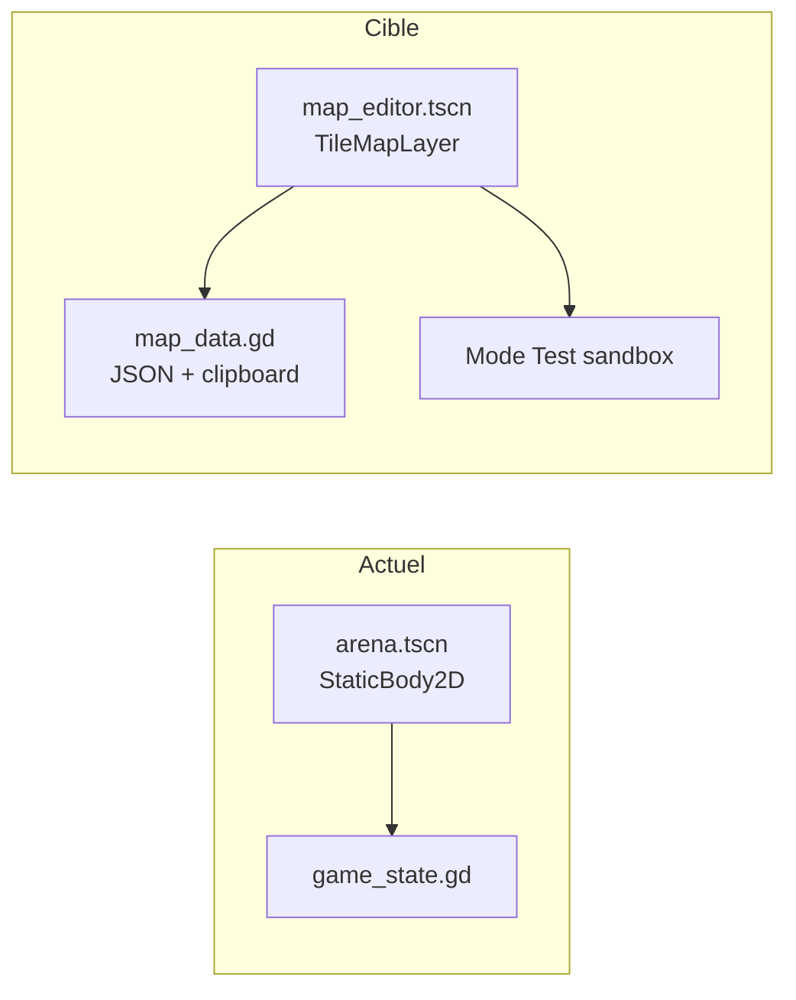
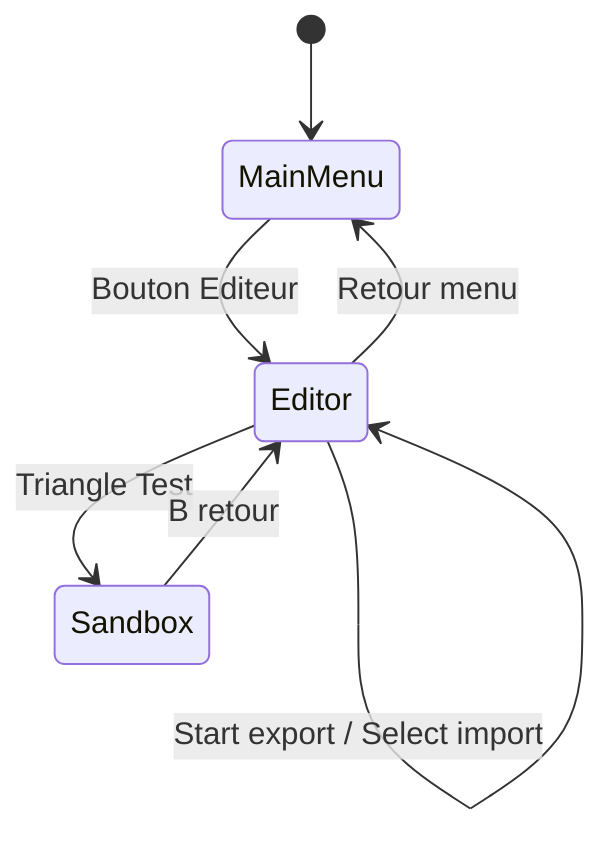

# Éditeur de carte Candela — Manette + TileMapLayer

## Contexte actuel

Le projet n'a **aucun éditeur** ni `TileMapLayer` en gameplay. L'arène (`[arena.tscn](arena.tscn)`) est une scène statique 700×700 px avec des `StaticBody2D` manuels et des spawns `Marker2D` lus par `[game_state.gd](game_state.gd)` au démarrage de round.




## Architecture cible

### Scène principale : `[map_editor.tscn](map_editor.tscn)`

```
MapEditor (Node2D) — script map_editor_gamepad.gd
├── Camera2D (vue fixe 700×700)
├── TileMap
│   ├── FloorLayer (TileMapLayer, z_index=0)
│   └── WallsLayer (TileMapLayer, z_index=1, collision physics layer 1)
├── SpawnPoints (Node2D)
│   ├── P1Spawn (Marker2D + Sprite2D visuel)
│   └── P2Spawn (Marker2D + Sprite2D visuel)
├── GridCursor (ColorRect ou Sprite2D semi-transparent)
├── SandboxLayer (Node2D, caché en mode édition)
│   └── TestPlayer (CharacterBody2D léger, déplacement stick)
└── EditorHUD (CanvasLayer)
    ├── StepIndicator (Label : "SOL / MURS / SPAWN P1 / SPAWN P2")
    ├── StatusToast (export/import feedback)
    ├── BtnTest (Button, focusable mais piloté par manette)
    └── PromptBar (icônes depuis assets/ui/prompts/*.svg)
```

### Scripts à créer


| Fichier                                          | Rôle                                                                          |
| ------------------------------------------------ | ----------------------------------------------------------------------------- |
| `[map_editor_gamepad.gd](map_editor_gamepad.gd)` | Cœur : curseur grille, peinture/effacement, étapes, clipboard, sandbox        |
| `[map_data.gd](map_data.gd)`                     | Autoload : sérialisation JSON, validation, rebuild des layers                 |
| `[candela_tileset.gd](candela_tileset.gd)`       | Factory procédurale du TileSet (damier + mur) + constantes atlas remplaçables |


### TileSet placeholder (remplaçable plus tard)

- Grille **20×20**, tuiles **35×35 px** → correspond exactement aux 700×700 px de l'arène actuelle.
- Atlas procédural 2×1 : `(0,0)` damier sombre (style `[game_state._setup_ambient_visuals()](game_state.gd)`), `(1,0)` mur noir.
- Physics sur le mur : `collision_layer = 1` (compatible `collision_mask = 1` des joueurs/balles).
- Constantes exportées dans `candela_tileset.gd` pour swap futur vers `res://assets/tiles/...` sans toucher la logique éditeur :

```gdscript
const TILE_SIZE := Vector2i(35, 35)
const GRID_SIZE := Vector2i(20, 20)
const FLOOR_ATLAS := Vector2i(0, 0)
const WALL_ATLAS := Vector2i(1, 0)
# const TILESET_PATH := "res://assets/tiles/candela_tileset.tres"  # futur
```

---

## `[map_editor_gamepad.gd](map_editor_gamepad.gd)` — logique détaillée

### État interne

```gdscript
enum EditorStep { FLOOR, WALLS, SPAWN_P1, SPAWN_P2 }

var current_step: EditorStep = EditorStep.FLOOR
var grid_pos: Vector2i = Vector2i(10, 10)
var move_cooldown: float = 0.0
const MOVE_REPEAT_DELAY := 0.18
var _sandbox_active: bool = false
```

### 1. Curseur de grille

- Déplacement via actions `editor_move_*` (stick gauche + D-Pad) avec anti-répétition :
  - Premier appui immédiat, puis répétition toutes les `MOVE_REPEAT_DELAY` s tant que l'axe/bouton est maintenu.
  - Clamp `grid_pos` dans `[0, GRID_SIZE - 1]`.
- Position visuelle : `cursor.global_position = active_layer.map_to_local(grid_pos) + tile_center_offset`.
- Couleur du curseur selon l'étape (vert sol, rouge murs, bleu P1, orange P2).

### 2. Dessin / Effacement


| Action InputMap | Bouton           | Comportement                         |
| --------------- | ---------------- | ------------------------------------ |
| `editor_draw`   | X / Carré (West) | Peindre tuile active ou placer spawn |
| `editor_erase`  | B / Rond (East)  | Effacer tuile ou spawn sous curseur  |


- **FLOOR / WALLS** : `set_cell(grid_pos, SOURCE_ID, ATLAS)` ou `erase_cell(grid_pos)` sur le layer ciblé.
- **SPAWN_P1 / SPAWN_P2** : déplacer le `Marker2D` correspondant ; garantir un seul spawn par joueur (pas de tuile posée).
- Peinture continue tant que le bouton est maintenu (`Input.is_action_pressed`).

### 3. Navigation d'étapes (L1 / R1)

- `editor_step_prev` (L1) / `editor_step_next` (R1) : cycle `current_step` 0→3.
- Signal `step_changed(step: EditorStep)` → HUD met à jour le label + couleur curseur.
- En mode sandbox, L1/R1 désactivés (retour édition via B).

### 4. Import / Export presse-papier

**Format JSON** (via `[map_data.gd](map_data.gd)`) :

```json
{
  "version": 1,
  "tile_size": 35,
  "grid_size": {"x": 20, "y": 20},
  "floor": [{"x": 0, "y": 0, "source_id": 0, "atlas_x": 0, "atlas_y": 0}],
  "walls": [{"x": 5, "y": 3, "source_id": 0, "atlas_x": 1, "atlas_y": 0}],
  "spawn_p1": {"x": 2, "y": 2},
  "spawn_p2": {"x": 17, "y": 17}
}
```

- **Export** (`editor_export`, Start) : `MapData.export_to_clipboard(floor_layer, walls_layer, spawns)` → toast "Copié !".
- **Import** (`editor_import`, Select/Back) : parse JSON, `clear` + rebuild layers + reposition spawns → toast succès/erreur.

### 5. Mode Test sandbox (Triangle / Y → `BtnTest`)

- Bascule `_sandbox_active` :
  - **Entrée** : masque curseur + HUD édition, instancie `TestPlayer` au spawn P1 (fallback centre), active déplacement stick.
  - **Sortie** (B / Rond) : supprime le joueur test, réaffiche l'éditeur.
- `TestPlayer` : `CharacterBody2D` minimal (~50 lignes) avec `move_and_slide()`, `collision_mask = 1`, vitesse fixe. Pas de tir, pas d'UI match.
- Collisions lues directement depuis `WallsLayer` (TileSet physics).

### Signaux exposés

```gdscript
signal step_changed(step: EditorStep)
signal map_exported(success: bool)
signal map_imported(success: bool, error: String)
signal sandbox_toggled(active: bool)
```

Le HUD écoute ces signaux pour mettre à jour labels/toasts et l'état de `BtnTest`.

---

## Inputs — `[input_setup.gd](input_setup.gd)`

Nouvelles actions (device 0 uniquement, scène éditeur isolée du gameplay) :


| Action                           | Binding                         |
| -------------------------------- | ------------------------------- |
| `editor_move_up/down/left/right` | Stick gauche + D-Pad            |
| `editor_draw`                    | `JOY_BUTTON_X`                  |
| `editor_erase`                   | `JOY_BUTTON_B`                  |
| `editor_step_prev`               | `JOY_BUTTON_LEFT_SHOULDER`      |
| `editor_step_next`               | `JOY_BUTTON_RIGHT_SHOULDER`     |
| `editor_export`                  | `JOY_BUTTON_START`              |
| `editor_import`                  | `JOY_BUTTON_BACK` (Select/View) |
| `editor_test`                    | `JOY_BUTTON_Y`                  |


Ajout d'une fonction `_setup_editor_inputs(device: int)` appelée depuis `_setup_all_inputs()`, sans conflit avec le gameplay (scènes séparées).

---

## HUD manette — `[map_editor_hud.gd](map_editor_hud.gd)`

Petit script UI connecté aux signaux de l'éditeur :

- Barre basse : étape active + prompts SVG (réutiliser le pattern icônes de `[ui.gd](ui.gd)` `_get_joypad_btn_info`).
- `BtnTest` : bouton visible, déclenché aussi par `editor_test` ; texte "TESTER" / "RETOUR ÉDITION" selon sandbox.
- Toasts éphémères (Label + tween fade) pour export/import.

---

## Intégration projet

### `[project.godot](project.godot)`

- Autoload `MapData="*res://map_data.gd"`.
- **Ne pas** remplacer `run/main_scene` — l'éditeur accessible via bouton menu.

### `[ui.gd](ui.gd)`

- Ajouter bouton **"ÉDITEUR DE CARTE"** dans l'onglet JEU du menu principal.
- `get_tree().change_scene_to_file("res://map_editor.tscn")` au press.
- Bouton **"RETOUR AU JEU"** dans l'éditeur (Start long-press ou option menu éditeur) → `main.tscn`.

### Pas de modification de `game_state.gd` dans ce scope

Le duel complet avec carte custom est **hors scope** (choix sandbox). `map_data.gd` reste prêt pour une future intégration arène dynamique.

---

## Fichiers impactés — résumé

**Créés :**

- `map_editor.tscn`, `map_editor_gamepad.gd`
- `map_editor_hud.gd`, `map_editor_test_player.gd`
- `map_data.gd`, `candela_tileset.gd`

**Modifiés :**

- `[input_setup.gd](input_setup.gd)` — actions éditeur
- `[project.godot](project.godot)` — autoload MapData
- `[ui.gd](ui.gd)` — entrée menu vers éditeur

**Non modifiés (phase 2 future) :**

- `[arena.tscn](arena.tscn)`, `[game_state.gd](game_state.gd)` — chargement carte custom en match

---

## Flux utilisateur




## Points d'attention technique

- **Godot 4.7** : utiliser `TileMap` parent + enfants `TileMapLayer` (API 4.3+), pas l'ancien `TileMap` monolithique.
- **Clipboard** : `DisplayServer.clipboard_get/set` — tester sur macOS (environnement dev actuel).
- **Focus UI** : en mode édition, désactiver le focus clavier sur les boutons (`focus_mode = FOCUS_NONE`) pour que la manette ne navigue pas accidentellement dans l'UI.
- **Occlusion lumière** : non requis pour le sandbox ; prévoir un slot `occlusion_layer` dans le TileSet pour phase future match.

