# Les lumières de la 0.8.0 — rapport de la session cloud « Lumières 0.8.0 »

> Branche `claude/lumieres-080`, partie de `claude/unrailed-isometric-feasibility-44klgh` (`2386906`), 2026-09-29.
> Décisions d'Adrien (29/09) : « Je veux augmenter la portée de chaque lumière. Il faudrait que la source de chaque lumière
> soit attachée au modèle 3D de chaque personnage avec un point lumineux là où la source part » ; **Q45** « ça doit au moins
> aller au bout de l'écran de chaque joueur » ; **Q46** le point lumineux visible seulement si la source l'est (« si son
> corps est devant, on ne voit pas le point lumineux »). Trois étapes, dans l'ordre, chacune prouvée avant la suivante.
> **État : L1 faite (`1a1bfe1`), L1bis faite (`3f18dea`)** (les faisceaux concentrés, demandés par Adrien à 15:26 après la
> planche de L1), **L2 faite (`74bce8d`), L3 faite**.
>
> ⚠️ **La fusion de la 0.8.0 (`24abbfc`, Q15 et Q42) dans cette branche n'est PAS faite** : demandée par la session
> coordinatrice (ordre 457), elle a été **refusée par les permissions de cette session** (« Modify Shared Resources »). Je
> ne l'ai pas contournée et je ne peux pas écrire à la coordinatrice (cette session cloud n'a pas le droit d'envoyer de
> messages) : **il faut qu'Adrien autorise la fusion ici**, ou qu'elle se fasse autrement selon sa décision. En attendant,
> tout est prouvé sur la base `2386906`, et la portée à ×1,25 est prouvée par le zoom local (`--zoom=1.25`, et
> `test_portee_ecran` en jeu). Ce que la fusion devra revérifier : mes gardes (`test_portee_ecran`,
> `test_faisceaux_concentres`, puis `test_lampe_modele`, `test_point_lumineux`), et par `grep` mes points d'ancrage
> (`portee_plancher`, `plancher_de_portee`, `ouverture_concentree`, `LENTILLE_LAMPE`, `pointe_torche`,
> `_suivre_lentilles_des_joueurs`). L2 ne touche ni aux occluders, ni aux capteurs, ni aux masques d'ombre : Q42 et Q55
> ne devraient pas entrer en conflit.

## Pour Adrien, en cinq lignes

0. **Les faisceaux sont plus concentrés** (L1bis, ta demande de 15:26) : de 10° (Braconnier) à 60° (Terrassier), les
   rapports entre classes gardés au mieux ; la planche « un faisceau par classe » est plus bas, avec la vue de J2.
1. **Ta torche va maintenant jusqu'au bord de ton écran**, dans toutes les directions, pour les dix classes, en écran scindé
   comme en vue unique, J1 comme J2. La portée se calcule depuis le cadrage : si le zoom passe à ×1,25 (Q15), elle suit
   toute seule (728 px aujourd'hui, 873 px à ×1,25).
2. **Toutes les classes portent donc aussi loin** (728 px ; elles allaient de 192 à 672) : leur différence tient désormais
   à l'ouverture du cône, à sa luminosité et à sa matière, plus à sa longueur. C'est le choix le plus prudent ; l'autre
   (tout allonger dans la même proportion) est en image plus bas — **question 1**.
3. **L'éblouissement porte aussi loin que la lumière** (il lit le même faisceau) : un Terrassier peut maintenant éblouir
   à 700 px au lieu de 190.
4. **Au bout de l'écran, la lumière est faible** (le faisceau s'éteint en douceur vers sa portée) : au coin, 5 % de sa
   force ; en haut ou en bas de l'écran, un tiers — **question 5**.
5. **Le coût est réel et doit se mesurer sur ton Mac** : sous le rendu logiciel du cloud, une image coûte 1,5 fois plus en
   écran scindé et 1,85 fois plus en vue unique. Le cloud ne dit pas ce que ça fait au 1 % bas de ton Mac.

## L1 — la portée atteint au moins le bord de l'écran

### Ce qui a changé

| fichier | quoi |
|---|---|
| `portee_ecran.gd` (neuf) | `PorteeEcran` : la distance au bord de l'écran dans une direction de visée, et la plus petite portée qui l'atteint partout (le coin). Calcul pur. |
| `weapon_data.gd` | `portee_plancher` (statique) : `portee_torche()` = max(portée de la classe, plancher) ; `echelle_torche()` se DÉRIVE de `portee_torche()` — un seul endroit dit jusqu'où la torche porte. |
| `settings_manager.gd` | `accorder_au_mode` pose le plancher depuis le cadrage qui s'applique ; `portee_ecran_du_duel` (toujours vrai en ligne) ; `--sans-portee-ecran` (débogage, hors ligne) rend le jeu d'avant. |
| `tools/test_portee_ecran.gd` (neuf, dans `run_suites.sh`) | les gardes, § « Preuves » |
| `tools/test_iso_camera.gd` | ses gardes du facteur ISO8 isolées du plancher (plancher à 0 le temps de la garde), et la conséquence du plancher gardée |
| `tools/banc_lumieres.gd` (neuf) | le banc d'images, du recensement et de la cadence |

### La géométrie

La caméra iso garde la profondeur de la vue 2D : au sol, elle montre un rectangle de `D = 1080 / zoom` de profondeur et
`D × sin 52° × largeur / hauteur` de large, dans les axes de l'écran, avancé vers la visée de `0,15 × D`. Dans la direction
`u` de la visée (au sol, axes de la caméra), le bord est à `min(demi-largeur / |u.x|, demi-profondeur / |u.y|) + 0,15 × D` ;
le pire cas est le coin. Le lacet ne change aucune distance : J1 à 45° et J2 à 225° ont le même rectangle, tourné.

| zoom | vue unique : haut / droite / coin | écran scindé : coin |
|---|---|---|
| ×1,5 (aujourd'hui) | 468 / 612 / **728 px** | 546 px |
| ×1,25 (Q15, à l'essai) | 562 / 735 / **873 px** | 656 px |

### Ce que la règle a demandé de choisir — le plus prudent, et les questions

Le plancher retenu est **le coin de la vue unique**, appliqué **à toutes les torches, dans tous les modes**, sans toucher
aux classes qui portaient déjà plus loin (aucune aujourd'hui). Portées d'avant : pistolet 307, fusil 346, Terrassier (pompe)
192, arbalète 672, Fumiste 288, Incendiaire 269, Sentinelle 499, Occulteur 250, Allumeur 230, Spectre 269 — toutes à
**728** au zoom d'aujourd'hui. Les doubles de killcam et la torche fantôme (qui lisent la même échelle) suivent.

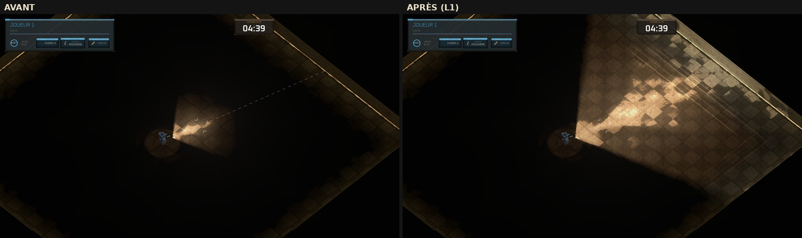
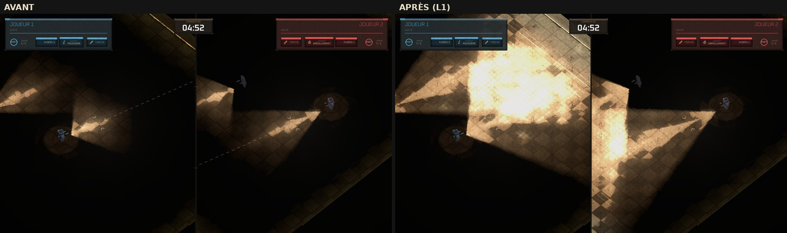
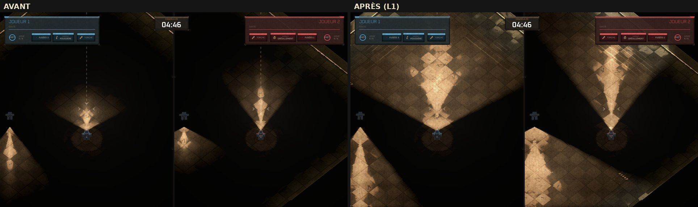
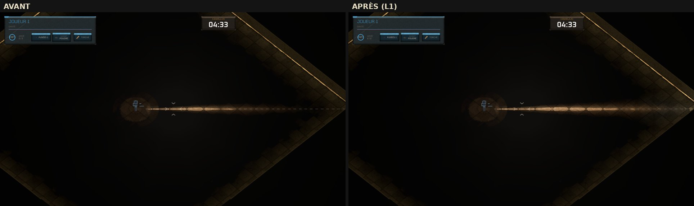
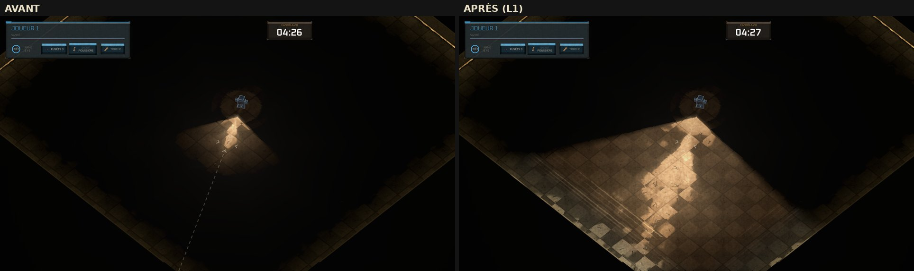

**Les options non retenues, en image :**

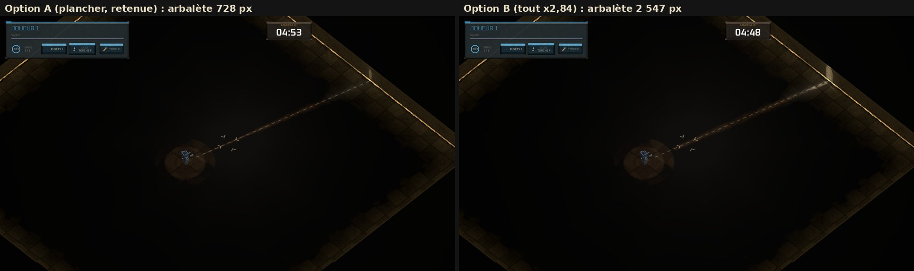
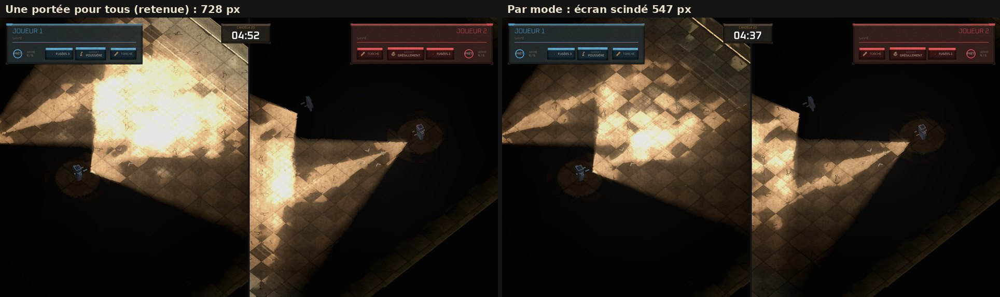

### Les gardes et les mesures

- **`tools/test_portee_ecran.gd`** (39 vérifications) : la formule (le coin couvre les 720 directions ; la vue unique couvre
  l'écran scindé ; la portée suit le zoom dans le rapport des zooms) ; la règle (allumée par défaut, toujours en ligne,
  `--sans-portee-ecran` en débogage seulement, plancher dérivé des constantes du duel en ligne) ; les dix classes (portée =
  max(propre, plancher), et le cookie l'étale jusque-là) ; **EN JEU, sur les vraies caméras iso** : écran scindé à 45° B (J1
  et J2), ×1,5 puis ×1,25, et vue unique, huit visées × dix classes — la lumière posée (`texture_scale` × cookie) va au
  moins jusqu'au point du sol où la visée sort de l'écran (marge la plus courte : 213 px en scindé, 49 px en vue unique), et
  la formule dit cette distance **à 0,00 px** près.
- **Le piège trouvé en route** : la première garde donnait à la formule la direction de visée lue À L'ÉCRAN, raccourcie en
  profondeur de sin 52°, et la croyait fausse de 26 px (consigné aux « Pièges connus »).
- **Quinze lumières par item** (`--plans=quinze` : écran scindé, deux torches, une fusée posée plein feu, un tir) : 10
  lumières actives avant comme après ; **au plus 10 par quadrant de 560 px avant comme après** — la carte n'a que quatre
  quadrants et tout s'y recouvrait déjà ; les quadrants éloignés passent de 1 à 3 lumières (les deux torches y entrent).
  Une torche de 728 px a un rectangle de 1 455 px : elle touche jusqu'à 3 × 3 quadrants au lieu d'un ou deux. **Sur une
  grande carte, chaque torche ajoute donc une lumière à des quadrants qu'elle ne touchait pas** : +2 (les deux torches), +3
  avec une torche fantôme. Le plafond de 15 reste loin dans les scènes mesurées ; une gerbe d'étincelles d'impact (12
  lumières) près d'une fusée, loin des joueurs, est le cas à surveiller (« Pièges connus », 2026-09-10).
- **La cadence, relative, sous Mesa** (Xvfb, rendu logiciel llvmpipe ; `--plans=cadence` : deux torches allumées, joueurs
  face à face en diagonale, médiane de 90 images, trois séries alternées) :

  | | avant | après L1 | rapport |
  |---|---|---|---|
  | écran scindé | 448 / 433 / 459 ms | 661 / 669 / 675 ms | **× 1,50** |
  | vue unique | 342 / 318 / 334 ms | 609 / 603 / 626 ms | **× 1,85** |

  Sous rendu logiciel, le coût suit la surface éclairée et dessinée ; ces rapports ne disent rien du 1 % bas du Mac, ils
  disent que **le changement n'est pas gratuit**. **À mesurer sur le Mac** (`bench_framerate`, série courte, la cible est
  « 1 % bas ≥ 60 » et le jeu la passait de deux images par seconde). La répartition (faisceau visible de Q41, lumières 3D
  miroir) suit, au § « Coût ».

### D'où vient le coût de L1 (décomposition, sous Mesa)

Même scène, une série par variante (médianes, en ms ; `--sans-faisceau-air` coupe le faisceau visible de Q41 ;
`--banc-sans-lumiere3d` coupe la lumière 3D miroir) :

| | avant, écran scindé | L1, écran scindé | avant, vue unique | L1, vue unique |
|---|---|---|---|---|
| tel quel | 502 | 772 (×1,54) | 366 | 642 (×1,75) |
| sans le faisceau dans l'air | 338 | 367 (**×1,08**) | 282 | 315 (**×1,12**) |
| sans la lumière 3D | 484 | 698 | 339 | 627 |

**Le surcoût vient presque entièrement du faisceau visible de Q41** : ses couches sont posées sur la texture de la lampe à
son échelle, donc leur surface croît comme le carré de la portée (×14 pour le Terrassier). La lumière 3D miroir n'y est
pour rien — elle est d'ailleurs **éteinte par défaut en jeu** (seuls les bancs l'allument). Si le prix se confirme sur le
Mac, le levier est là (couches du faisceau bornées en longueur, ou moins de couches), pas dans la portée elle-même.

## L1bis — des faisceaux plus concentrés

Adrien, 15:26, après la planche de L1 : « Il faut que les faisceaux des lumières soient plus concentrés. Faisons en sorte
que tu gardes les mêmes rapports d'angle, mais tu adaptes pour que le plus petit fasse 10° et le plus grand 60° par
exemple. Fais-moi une planche où on voit le faisceau de chaque classe, après correction. »

**La loi** (retenue par la session coordinatrice) : en ouverture totale, `10° × (ouverture / 10°)^k`, k = ln 6 / ln 12 ≈
0,721 — les deux bornes exactes, chaque rapport entre deux classes élevé à la même puissance. **Les deux autres lectures,
non faites** : tout diviser par deux (5° à 60°, rapports exacts) ; ou linéaire de 10° à 60°.

| classe | avant | après |
|---|---|---|
| Braconnier (arbalète) | 10° | 10,0° |
| Sentinelle | 16° | 14,0° |
| Illusionniste (fusil) | 20° | 16,5° |
| Spectre | 40° | 27,2° |
| Occulteur | 50° | 31,9° |
| Fumiste | 60° | 36,4° |
| Parasite (pistolet) | 70° | 40,7° |
| Incendiaire | 80° | 44,8° |
| Allumeur | 90° | 48,8° |
| Terrassier (pompe) | 120° | 60,0° |

**Les cookies sont RESSERRÉS, pas recuits** (`tools/concentrer_cookies.gd`). L'angle est cuit dans le cookie, mais les
réglages de la cuisson retenue (`bis04`) ne sont consignés nulle part : recuire aurait changé la matière au hasard. L'outil
déforme le cookie livré en polaire (l'écart à l'axe resserré dans le rapport des angles, la distance intacte) : portée,
profil le long de l'axe, matière et luminosité sont ceux d'avant. **Le halo court de l'émetteur est gardé tel quel** — le
premier jet le resserrait aussi, et « quelqu'un collé à une torche allumée est vu, même hors du faisceau » cessait d'être
vrai (`test_vision` l'a vu). L'outil mesure le demi-angle cuit dans l'image et refuse de resserrer deux fois.

**Toute la chaîne suit** parce que tout lit `torch_angle_deg` ou le cookie : l'éblouissement (il lit le cookie : il verse dans
le cône resserré, plus rien à 3° hors de lui), la fiche de classe (l'ouverture affichée), le mannequin, la killcam, la torche
fantôme. La lumière 3D miroir couvre toujours le cône (plancher de 75°) : rien à changer. Gardes adaptées :
`test_vision` (la cible « en plein dans la flaque du pompe » passe de 40° à 20° de l'axe), `test_iso_camera` (le pistolet à
20,34°). Nouvelle garde : `tools/test_faisceaux_concentres.gd` (56 vérifications).

**La planche** (vue iso à 45° B, zoom ×1,25, la portée de L1 comprise — 873 px —, J1 seul allumé, visée vers le coin
haut-droit de son écran ; avant = L1, après = L1bis) :

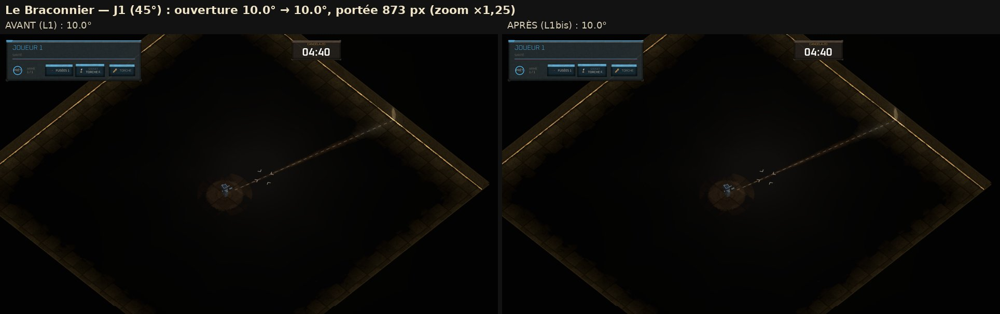
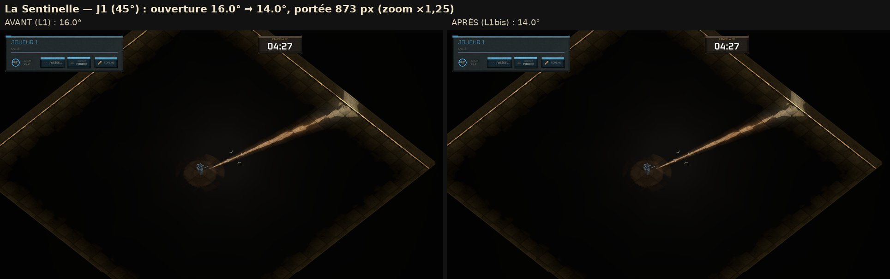
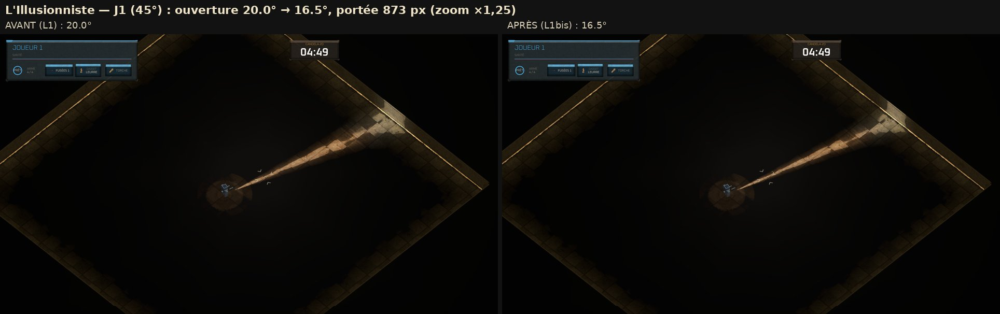
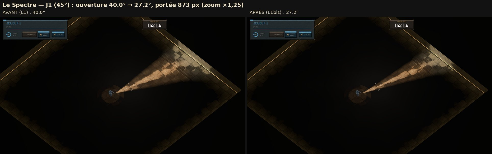
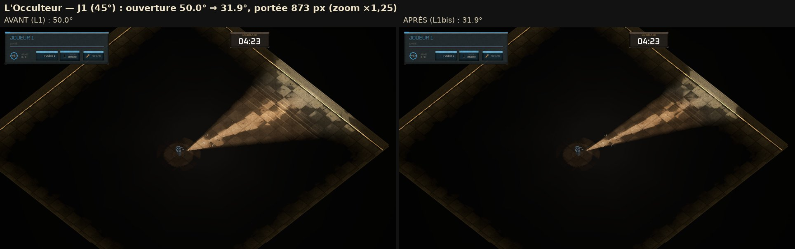

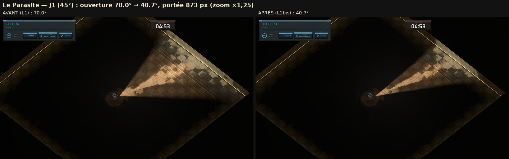
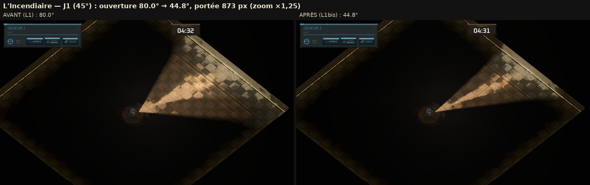
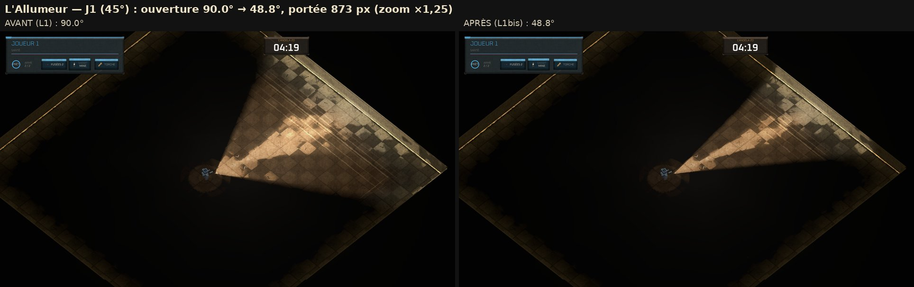
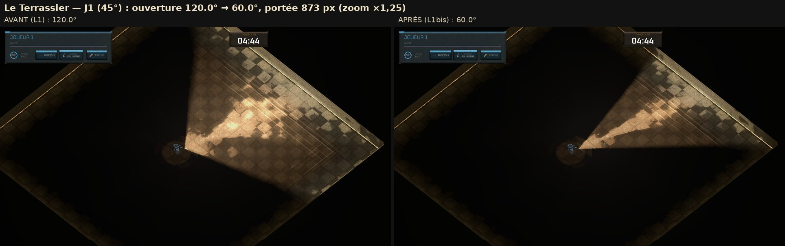

**Vue de J2** (caméra à 225°, même scène tournée) : 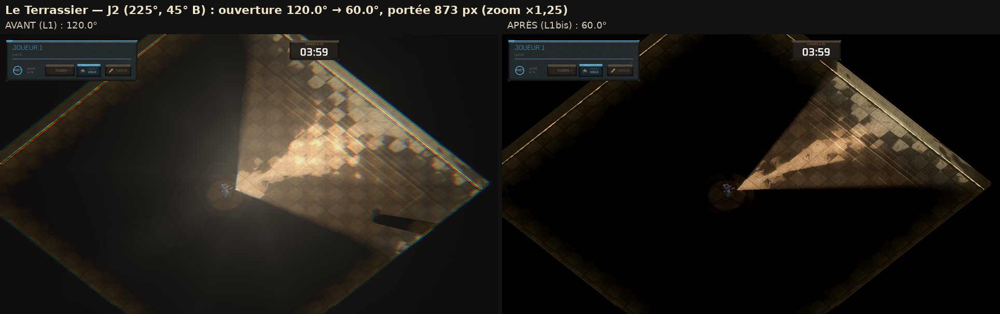 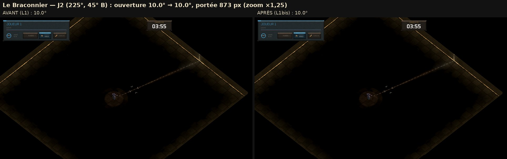
et l'équité, J1 | J2 après correction : 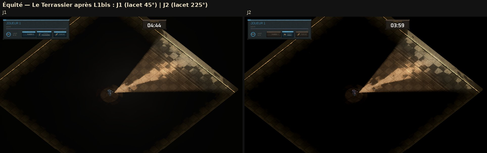 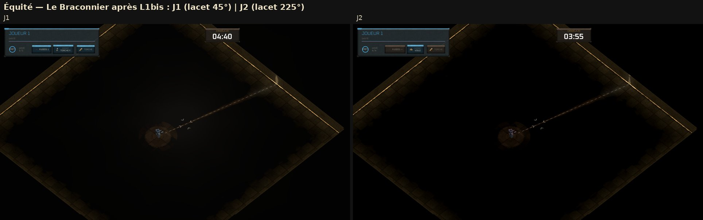
(le panneau du HUD porte « JOUEUR 1 » sur les prises de J2 : c'est le HUD de la vue unique du banc, pas le jeu en ligne.)

**La cadence, L1 → L1bis, sous Mesa** (zoom ×1,25, Terrassier et pistolet allumés, trois séries alternées, médianes en ms) :

| | L1 | L1bis | rapport |
|---|---|---|---|
| écran scindé | 658 / 681 / 626 | 591 / 610 / 554 | **× 0,89** |
| vue unique | 598 / 604 / 567 | 562 / 546 / 498 | **× 0,91** |

Plus étroits, les faisceaux coûtent bien MOINS, mais peu (~10 %) : le rectangle d'une lumière 2D et les couches du faisceau
visible sont des CARRÉS posés sur la texture de la lampe, dont la taille suit la portée et non l'ouverture ; seule la part
éclairée dans ces carrés rétrécit. Le prix de L1 (§ « D'où vient le coût ») reste donc à mesurer sur le Mac.

## L2 — la lumière part de la lampe tenue par le modèle 3D

**Ce qui a changé.** La lampe 2D — donc tout ce que le jeu éclaire, l'ombre des murs comprise — part du bout du fût de la
torche que tient le corps voxel : `Player.LENTILLE_LAMPE`, 16,1 px devant le centre et 4,55 px à gauche (la main qui
n'engage pas la visée), **dérivée du squelette** (`VoxelCatalogue.SQUELETTE`), où la torche est la même pour les dix
classes. Elle valait (30, 0) : 30 px devant, détachée de la main. **Rien sur le fil** : les deux machines la calculent de la
position et de la visée qu'elles ont déjà ; `Protocol.VERSION` reste 19.

- **Le recul contre les murs garde sa règle** (« si on est collé à un mur, on peut éclairer derrière », 2026-09-11) : le
  rayon va du centre à la lentille, et la lampe recule sur lui. La rétrodiffusion garde sa place (18 px droit devant) et son
  recul d'avant.
- **La lumière 3D miroir** prend la hauteur de la lentille (`VoxelCorps.pointe_torche`, pose courante : 19,1 px debout, au-
  dessus du muret, sous le canon de jeu de 35 px). ⚠️ Elle est **éteinte par défaut en jeu** (seuls les bancs l'allument) :
  ce point-là ne se voit pas dans le jeu livré.
- **Le faisceau visible (Q41)** part de la lampe 2D : de la lentille, lui aussi.
- **Ce qui ne bouge pas** : l'éblouissement se mesure toujours depuis le centre du corps ; l'écart entre ce point et
  l'origine de la lumière passe de 30 à 16,7 px. Le flash de tir reste au canon.
- **Ce que l'image montre** (vue unique, pistolet, quatre visées ; loupe ×2) : au sol, le cône part maintenant juste sous la
  torche du modèle, au lieu de 30 px devant le corps. La lumière reste AU SOL (la lightmap est projetée sur le sol) : la
  lentille, elle, est en l'air, à hauteur de main — c'est ce que L3 dessine.

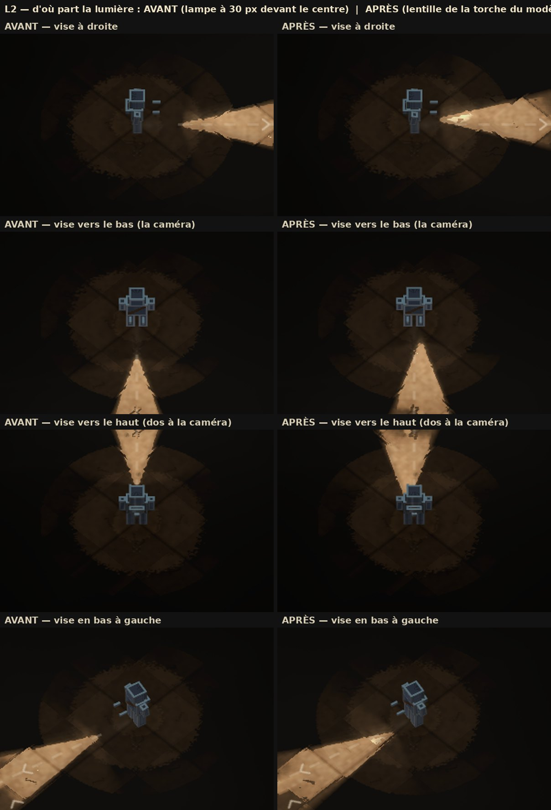

**Preuve** : `tools/test_lampe_modele.gd` (13 vérifications) — la lentille dérivée du squelette et la même pour les dix
classes ; en jeu, écran scindé à 45° B, J1 et J2 dans huit visées : lampe 2D et bout du fût voxel au même point (écart
**0,000 px**) ; en vue unique, lumière 3D à la lentille au sol et en hauteur ; face à un mur (18 et 15 px), recul sur le
rayon, jamais dans le mur ; rétrodiffusion comme avant ; `Protocol.VERSION` inchangé.

## L3 — le point lumineux à la source (Q46)

Au bout du fût de la torche du modèle, deux lueurs : un cœur franc (5 px) et un halo doux (16 px, au tiers), à l'énergie de
la lampe. **On le voit seulement si la lentille est visible depuis la caméra de CE joueur** : de face, plein ; de profil, un
filet ; de dos, rien — et le corps ou un mur devant le cachent (la profondeur 3D). Chaque vue de l'écran scindé juge avec
sa caméra : aucune différence J1/J2. Rien d'autre ne le lit (une image, pas une lumière). `--sans-point-lumineux` l'éteint
en débogage.

**À l'image** (écran scindé, 45° B, J1 seul allumé, huit visées ; chaque ligne : vue de J1 éteint | allumé, vue de J2
éteint | allumé ; « +x/255 » = ce que le point ajoute autour de la lentille, « bruit » = ce que la scène change seule — le
corps voxel respire) :

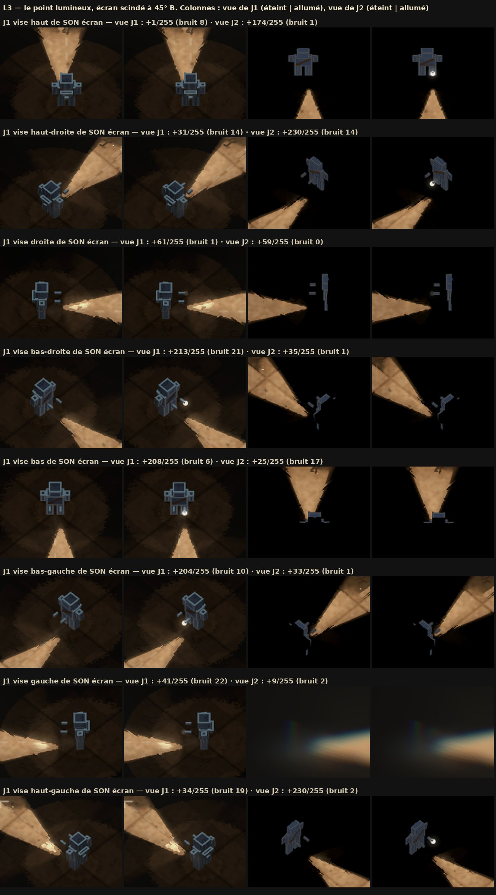

| J1 vise (de son écran) | vue de J1 | vue de J2 |
|---|---|---|
| haut (dos à sa caméra) | +1 (bruit 8) — **caché** | +174 — de face pour J2 |
| haut-droite / haut-gauche | +31 / +34 (bruit 14 / 19) | +230 / +230 |
| droite / gauche (de profil) | +61 / +41 — un filet | +59 / +9 |
| bas-droite / bas / bas-gauche | **+213 / +208 / +204** | +35 / +25 / +33 (bruit ≤ 17) |

**L'éblouissement** (le halo d'écran de `brouillage_vue.gd`) passe au-dessus : ébloui, on voit le halo par-dessus le point.
Rien à changer, les deux disent « une lampe est là ». **Le faisceau visible** (Q41) part de la même lentille depuis L2.
**Le « cœur chaud à la lampe »** d'ISO13 (`--faisceau`, éteint par défaut) fait doublon avec ce point : à retirer si tu
gardes celui-ci (hors de ma tâche, signalé).

**Preuve** : `tools/test_point_lumineux.gd` (20 vérifications : défaut, drapeau de débogage, shader = formule GDScript,
de face / profil / dos pour les caméras de J1 et J2, équité miroir à 0,000000, le point posé au bout du fût de chaque
joueur à l'énergie de la lampe, éteint avec elle, sans effet sur les lumières 2D).

## Questions pour Adrien

1. **Plancher ou facteur ?** Retenu : le plancher — toutes les torches vont au moins au bord (728 px), aucune ne va plus
   loin : **l'écart de portée entre les classes disparaît**. L'autre voie : tout allonger dans la même proportion (×2,84)
   pour que la plus courte (le Terrassier) atteigne le bord — l'écart est gardé, mais l'arbalète porte à 2 547 px (plus de
   trois écrans) et chaque torche coûte bien plus (image « Option B »).
2. **Une portée pour tous les modes, ou une par mode ?** Retenu : une seule, celle de la vue unique (728 px), aussi en écran
   scindé, où l'écran est plus étroit (546 px suffiraient). Une portée par mode ferait jouer l'écran scindé autrement que
   le jeu en ligne — la portée est une règle (l'éblouissement la lit), pas un cadrage.
3. **La torche seule, ou toutes les lumières ?** Retenu : la torche (et ce qui la copie : killcam, torche fantôme). Les
   autres gardent leur taille : la fusée posée (halo de 220 px de rayon), le flash de tir (32 px), le halo de
   rétrodiffusion (128 px). « Aller au bout de l'écran » n'a pas de direction pour une lumière ronde posée au sol : faut-il
   que le halo d'une fusée remplisse l'écran ?
4. **Près d'un bord de carte**, la caméra s'arrête et le joueur peut viser un bord d'écran plus lointain (jusqu'à toute la
   largeur, ~940 px) : la règle ne le couvre pas. Le couvrir demanderait la diagonale entière de l'écran (~1 240 px).
5. **Jusqu'où « aller au bout » ?** Le faisceau s'éteint en douceur vers sa portée : au coin de l'écran il ne verse plus
   que 5 % de sa force, un tiers en haut ou en bas. Si « au bout » veut dire « bien visible au bord », il faut une portée
   plus longue encore ou un cookie qui garde sa force plus loin.
6. **Le coût** : à mesurer sur le Mac avant de publier.
7. **Le point lumineux (L3)** : taille (5 px et un halo de 16 px), force, et le filet de profil (16 %) sont des points de
   départ, à doser sur l'image. Faut-il aussi un point pour la torche de la killcam (les doubles ne l'ont pas) ?
