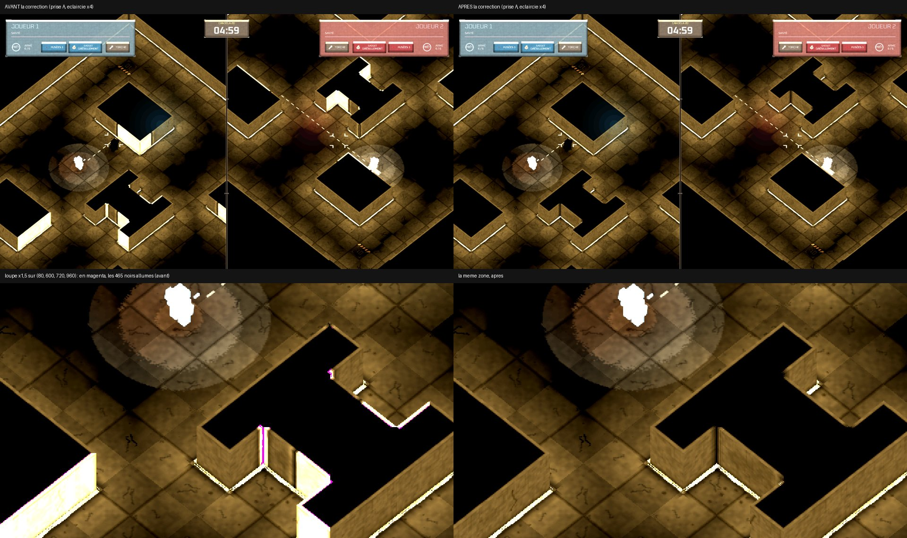
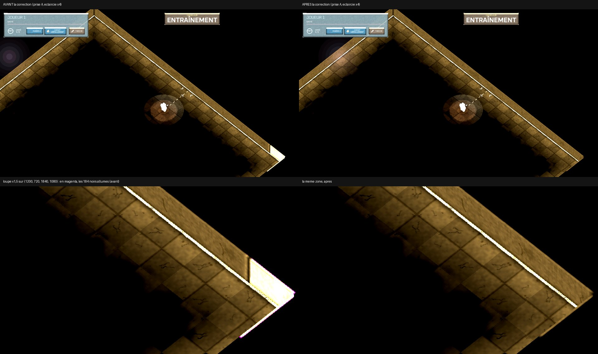

# La peinture iso périmée — arrive-t-elle en vraie partie ? Et la correction

Session cloud, branche `claude/cloud-peinture-perimee`, partie d'`origin/integration-iso14` (a30a407), le 28/09/2026.
Lancée par la session coordinatrice « CLOUD ISO UNRAILED ».

## Pour Adrien, en cinq lignes

1. **Oui, le défaut arrive en vraie partie** : quand on change de carte sur l'écran de fin sans repasser par le menu, les
   murs de la nouvelle carte peuvent s'allumer dans le noir (jusqu'à 230 sur 255), comme sur les images `img/`.
2. En ligne, ça arrive **à chaque fois** que l'hôte change de carte après un match, chez lui **et** chez son adversaire.
3. En écran partagé, ça arrive après un match nul au temps, et à l'entraînement lancé depuis l'écran de fin ; après un
   kill, un hasard (la killcam qui change l'affichage) l'efface.
4. La correction tient en une ligne (refaire la « peinture » des murs en même temps que les murs) ; elle est prête sur
   cette branche, testée, et **pas appliquée au jeu** : elle attend ton accord.
5. Les chiffres de l'évaluation 11 sur la Croisée et le Bunker sont refaits avec la bonne peinture (§ 4).

## État

- [x] les chemins, par le code puis à l'image (§ 1, § 2)
- [x] la correction, sa garde rouge avant / verte après, cueillie à blanc sur les deux bases (§ 3)
- [x] le coût compté (§ 3)
- [ ] l'évaluation 11 en petit (§ 4) — en cours
- [ ] la suite complète

Les commits, dans l'ordre (tous sur `claude/cloud-peinture-perimee`) :

| commit | ce qu'il fait |
|---|---|
| `7c5306c` | le photographe sous Xvfb (cueilli de `claude/cloud-photographe`, 0c67705) |
| `2f8f58c` | le banc des chemins du jeu, `tools/photo_peinture_perimee.gd` |
| **`b678553`** | **la correction seule** (`presentation_3d.gd`) + sa garde (`tools/test_iso_peinture_carte.gd`) + son inscription dans `tools/run_suites.sh` — le commit à cueillir |
| la suite | les mesures, le banc en ligne, les images, ce rapport |

## 1. Les chemins — où `rebuild_arena()` tourne vue iso allumée

Le mécanisme, rappelé : `rebuild_arena()` (`game_state.gd:965`) rappelle le crochet (`Presentation3D.accrocher`,
`_reconstruire = true`). Si la vue iso tient (`_vues_a_projeter` inchangée), `presentation_3d.gd:487` refait les murs et
PAS la peinture. Si les vues regardées changent dans la même image, `_process` éteint puis rallume (`_allumer`), et
`_allumer` refait la peinture : **le défaut n'existe que quand la carte change SANS bascule des vues.** C'est la clé de
tout le classement ci-dessous, et elle ne se lit qu'en suivant les vues, pas les cartes.

Ce qui décide des vues (`_vues_a_projeter`, `presentation_3d.gd:520`) : `mode_iso`, pas sous un menu (`ui._is_main_menu`),
les conteneurs visibles. **L'écran de fin laisse `_is_main_menu` à faux** (`ui.gd:8548`, `show_game_over`) : la vue iso
reste allumée derrière lui. Et il pousse l'écran du salon du mode joué (`ui.gd:8571`, `hub.push(_screen_for_current_mode())`),
qui porte **CHANGER DE CARTE** en local (`ui.gd:4231`) comme chez l'hôte en ligne (`ui.gd:4288`).

| # | chemin | fichier : ligne | la carte peut-elle changer ? | vues avant → après | peinture | classement |
|---|---|---|---|---|---|---|
| 1 | **écran de fin → CHANGER DE CARTE → REJOUER, match fini AU TEMPS** (écran scindé local) | `ui.gd:4231`, `map_gallery.gd:465`, `game_state.gd:5068` (`_start_round`) → `_do_start_round` `:1489` | oui | {J1, J2} → {J1, J2} (match nul : pas de killcam, `game_state.gd:3831` n'en lance qu'avec un vainqueur) | **périmée** | **vraie partie** — mesuré § 2 |
| 2 | le même, match fini par un KILL | idem | oui | {J1} (la killcam cache la vue de J2, `game_state.gd:3970`) → {J1, J2} (`_restore_viewports` `:5614`) | refaite par la bascule | vraie partie, **épargnée par hasard** — mesuré (journal) |
| 3 | **écran de fin → retour → accueil → ENTRAÎNEMENT**, après un kill | `ui.gd:5111` (en local, le retour ne ferme PAS le salon : `_is_main_menu` reste faux), `ui.gd:5179`, `game_state.gd:893` (`select_map(DEFAULT)`) | oui (→ l'arène standard) | {J1} → {J1} (`_restore_viewports` `:5597`) | **périmée** | **vraie partie** — mesuré § 2 |
| 4 | le même après un match nul | idem | oui | {J1, J2} → {J1} | refaite par la bascule | vraie partie, épargnée |
| 5 | **en ligne : l'hôte change de carte à l'écran de fin, puis REJOUER des deux côtés** | `ui.gd:4288` ; hôte : `_check_rematch_start` `game_state.gd:5195` → `rpc_start_round` `:1395` ; invité : `_adopt_host_map` `:1420` puis `_do_start_round` | oui, **chez les deux** | hôte {J1} → {J1}, invité {J2} → {J2}, kill ou pas (en ligne la killcam ne touche pas aux vues de l'invité, et l'hôte n'a jamais la vue de J2) | **périmée chez les deux** | **vraie partie** — établi à deux instances ENet, sans rendu (§ 2) |
| 6 | la première manche en ligne (l'invité adopte la carte de l'hôte au premier `rpc_start_round`) | `game_state.gd:1395` | oui | l'invité est au salon (`_is_main_menu` vrai) : vue éteinte → allumée APRÈS la reconstruction | posée neuve | impossible — mesuré (journal, manche 1 « à jour ») |
| 7 | l'appariement (classé : carte tirée au sort) lancé depuis l'accueil **atteint par le retour de l'écran de fin** | `game_state.gd:4956` → `_poser_la_carte_appariee` | oui | selon la fin du match précédent et le rôle (hôte {J1}) | périmée si {J1} → {J1} | **probable, établi par le code seulement** (exige Epic : non reproduit) |
| 8 | la revanche sur la même carte (REJOUER), toute fin | `game_state.gd:5068` | non | — | copies de calques libérés, **au contenu identique** | sans effet visible — mesuré : A = B au bit (§ 2) |
| 9 | chaque manche d'un match | `_do_start_round` `:1489` | non (BO1 : une manche par match) | — | — | = chemin 8 |
| 10 | l'éditeur de cartes (« tester », F5) | `map_gallery.gd:512` : `change_scene_to_file` | oui | `Main` libéré → vue éteinte → rallumée sur le nouveau `Main` | posée neuve | impossible (par le code) |
| 11 | la killcam | aucun `rebuild_arena` | non | — | — | impossible |
| 12 | le retour au menu principal, puis une partie | `_on_main_menu_requested` `game_state.gd:5647` | oui | sous le menu, vue éteinte (`presentation_3d.gd`, garde « pas sous les menus ») | posée neuve à l'allumage | impossible |
| 13 | les bancs qui posent une carte en pleine manche (`photo_ecart.gd` de l'évaluation 11, `photographe.gd` `_passer_sur_la_carte_des_murs_bas`, `banc_claustro.gd`, `banc_iso_beaute.gd`, `banc_iso_gadgets.gd`, `banc_lumiere3d.gd`, `banc_murs_bas.gd`) | `tools/…` | oui | inchangées | **périmée** | seulement dans les bancs (déjà établi par « Sol marqué (2) ») |

**À carte égale (chemins 8 et 9)**, ce que la peinture copiée garde de périmé : ses trois calques statiques (sol, décor
cuit, encre des murs) sont des copies de nœuds que `rebuild_arena` a libérés — mais au même contenu, le décor étant
déterministe (aucun tirage dans `arena_decor.gd` ni `mur_encre.gd`). Les calques dynamiques ne sont pas en cause :
- **le sang, les impacts, les douilles** sont copiés à la POSE, par le signal `child_entered_tree` de l'arène
  (`peinture_iso.gd:208`), qui est le même nœud d'une manche à l'autre, et retirés avec leur original (`tree_exiting`,
  `:235`). La peinture en place, périmée ou non, porte donc les traces que porte le sol 2D, ni plus ni moins. Les murs de
  la manche 2 lisent bien le sang de la manche 1 — **parce qu'il est toujours au sol, par décision** (`blood_stain.gd:8-13` :
  « les taches racontent le match entier, manche après manche, rematch compris ; seul le retour au menu principal les
  balaie ») ;
- **les empreintes** ne sont jamais peintes (`peinture_iso.gd:25`) ;
- **l'usure** n'est pas dans la peinture : sa carte de proximité est refaite avec les murs (`_construire_les_murs`).

Mesuré : revanche après un match nul (le seul cas sans bascule), prise A contre peinture refaite, **0 pixel différent**.
Non mesuré à l'image avec du sang au sol (la mise à mort du banc passe par `take_damage`, qui ne dépose pas de tache) : le
chemin du sang est établi par le code.

## 2. Les mesures — avant et après la correction

**Le banc** (`tools/photo_peinture_perimee.gd`) ne pose aucune carte à la main : une manche en écran scindé local lancée
depuis le menu, puis la fin (J2 abattu, ou `--fin=temps` : le chronomètre mené à zéro), l'écran de fin, et le geste du
joueur — la vignette de la galerie (`MapGallery._on_tile_pressed`), le bouton du cadre (`panel_launch`), le retour de la
liste (`MenuHub.back`), l'entrée ENTRAÎNEMENT (`_on_hub_action`). À l'arrivée, torches éteintes, J1 et J2 à la mise en
scène du duel du photographe, **jeu en pause**, trois prises de l'écran : **A** (tel que le chemin l'a laissé), **B** (la
peinture refaite à la main, le geste de `_allumer`), **B2** (dix images plus tard : le bruit). Un pixel est noir à ≤ 7 au
canal maximal (le seuil des sessions « sol marqué »). Chaque séance imprime des lignes `PEINTURE` : vue allumée ou non,
vues regardées, bascules, cadre de la peinture que lisent les murs, carte posée. **J'ai regardé la première image de
chaque séance : aucune intro.**

| chemin (§ 1) | carte | AVANT : noirs de B allumés dans A | AVANT : pixels A ≠ B | APRÈS : A contre B | bruit B → B2 |
|---|---|---|---|---|---|
| 1 — fin au temps, CHANGER DE CARTE, REJOUER | Cloître → Croisée | **1 125** (870 > 30/255, 292 > 100, **max 230**) | 44 487 (écart max 227) | **identiques au bit** | 0 |
| 3 — kill, retour, ENTRAÎNEMENT | Cloître → arène standard | **226** (138 > 30, 15 > 100, **max 210**) | 6 810 (max 208) | 329 pixels à ≤ 4/255, dont 2 noirs allumés à ≤ 8 | 0 |
| 8 — fin au temps, REJOUER | Cloître → Cloître | 0 | **0** | identiques au bit | 0 |
| référence — la Croisée lancée depuis le menu | Croisée | — | — | identiques au bit | 0 |
| 2 — kill, CHANGER DE CARTE, REJOUER | Cloître → Croisée | journal : peinture refaite par la bascule (1 050 px de côté à la manche 2) | | | |



*En haut, la prise A avant et après la correction (éclaircies ×4) ; en bas, la loupe, les noirs allumés en magenta.
Des pans entiers de faces de la Croisée s'allument : elles lisent les murs et l'encre du Cloître.*



*Le même défaut à l'entraînement : la face du coin, en bas à droite, lit la peinture du Cloître. Les deux moitiés viennent
de deux lancements : leurs différences ailleurs (le disque en haut à gauche) sont celles d'un lancement à l'autre.*

**En ligne** (chemin 5), deux instances headless en ENet local (`tools/banc_peinture_en_ligne.gd`,
`docs/iso/cloud/peinture-perimee/en_ligne.sh`), par les gestes : l'hôte ouvre son salon sur le Cloître, l'invité
rejoint, PRÊT, J2 abattu, l'écran de fin, l'hôte choisit la Croisée dans la galerie, REJOUER des deux côtés. Journaux
complets : `en_ligne_avant.txt`, `en_ligne_apres.txt`.

| | manche 1 | écran de fin | manche 2 (la Croisée) | bascules des vues |
|---|---|---|---|---|
| AVANT, hôte | à jour (1 120) | à jour | **PÉRIMÉE : cadre 1 120 (le Cloître) pour une carte de 1 050** | 0 |
| AVANT, invité | à jour | à jour | **PÉRIMÉE, idem** | 0 |
| APRÈS, hôte et invité | à jour | à jour | à jour (1 050) | 0 |

Sans rendu, ce banc prouve le CHEMIN (la carte change vue allumée, sans bascule, chez les deux) et l'état de la peinture ;
l'image de la même situation — les murs de la Croisée sur la peinture du Cloître — est celle du chemin 1.

**« Rien d'autre ne change » : au bit près**, sur les chemins 1 et 8 et la référence (A = B, 0 pixel), c'est-à-dire que
la peinture que pose la correction à la reconstruction est exactement celle que pose l'allumage. À l'entraînement, **au
bruit près** : 329 pixels à ≤ 4/255 dans un disque en dégradé hors des murs (`img/entrainement.jpg`, en haut à gauche), 2
pixels au seuil du noir à ≤ 8 ; cause non établie (hypothèse : une copie de trace figée à sa pose, `peinture_iso.gd`
recopie les variables une fois). Entre deux LANCEMENTS, le bruit est trop grand pour comparer au pixel (442 à 120 000
pixels changés, d'autres états du jeu : HUD, souffle des corps, halos) : c'est pourquoi toutes les preuves ci-dessus sont
faites au même instant gelé.

## 3. La correction

```gdscript
		if _reconstruire:
			_construire_les_murs()
			_poser_peinture()
```

`presentation_3d.gd:487`, dans `_process`. `_poser_peinture` retire l'ancienne d'abord (`_retirer_peinture`). Murs et
peinture sont **les deux seuls états de la présentation dérivés de la carte** (`MapData.get_selected()` n'est lu qu'à
`_poser_peinture` et `_construire_les_murs` ; la LED est relue à chaque image) : il n'y a rien d'autre à refaire.
`_allumer` reste le seul autre poseur, et ne pose qu'une fois (il remet `_reconstruire` à faux avant que `_process`
n'y arrive). Trois commentaires suivent (`presentation_3d.gd:201`, `:333`, `:996`), qui disaient « refaite à chaque
allumage ».

**Pourquoi pas mieux ?** Deux autres voies ont été pesées et écartées :
- ne refaire la peinture que si la CARTE a changé : l'économie ne vaut qu'aux revanches, et laisserait la peinture sur
  des copies de calques libérés — sans effet mesuré aujourd'hui, mais c'est précisément le genre d'état qui cesse d'être
  inoffensif sans prévenir (un calque qui cesserait d'être déterministe) ;
- faire suivre la carte à `peinture_iso.gd` lui-même (écouter l'arène) : plus de code, dans un fichier qui n'a pas à
  savoir ce qu'est une carte. Refaire au même endroit que les murs garde la règle en une ligne : **les murs et ce qu'ils
  divisent, ensemble.**

**Aucun calque dynamique n'est en cause à carte égale** (§ 1) : rien de plus à faire pour le sang.

**La garde** : `tools/test_iso_peinture_carte.gd` (headless, sans rendu, inscrite dans `tools/run_suites.sh`). Une
partie locale en écran scindé sur le Cloître, puis `_start_round` (le démarrage de REJOUER) sur la Croisée, puis une
revanche, en vérifiant que les vues n'ont PAS basculé (sinon elle ne prouverait rien) : la peinture en place est cadrée
sur la carte posée, les murs et les sols lisent cette peinture-là, et sa copie de décor vient du décor de l'arène en
place, pas d'un calque libéré.

| base | commit cueilli | garde AVANT (le `presentation_3d.gd` de la base) | garde APRÈS |
|---|---|---|---|
| cette branche | `b678553` | **4 échecs** (cadre du Cloître sur la Croisée ×2, décor copié d'un calque libéré ×2) | 24 vérifications, 0 échec |
| `origin/integration-iso14` (a30a407) | cueillette **propre** (worktree jetable) | 4 échecs | 24 / 0 |
| `origin/claude/cloud-integration-blanc` (d84c650) | cueillette **propre** (worktree jetable) | 4 échecs | 24 / 0 |
| `origin/claude/cloud-ecart-11` (2a2c099, pour le § 4) | conflit dans `tools/run_suites.sh` seul (la liste des suites diffère), `presentation_3d.gd` propre | — | — |

**Ce qu'elle coûte**, à chaque manche (y compris les revanches), une fois, pendant le décompte :
- **le travail** : une sous-vue neuve (`SubViewport` de 910 à 1 190 px de côté selon la carte, 3,2 à 5,4 Mo en RGBA8,
  l'ancienne libérée), la copie de trois calques et des traces présentes, quatre carrés d'étalon, et le rebranchement de
  la texture sur le matériau des murs et les deux sols. `_poser_peinture` a pris **5 à 9 ms de processeur dans le cloud**
  (`cout.txt` : 7,4 ms Croisée, 5,1 ms arène standard, 5,5 ms Cloître, 9,3 ms la Croisée d'un autre lancement) — un
  ordre de grandeur sur le processeur du conteneur, **pas une mesure de cadence** ;
- **les appels de dessin** : **+49 sur UNE image** en écran scindé à la Croisée (286 → 335 → 286), +41 au Cloître, +16
  en vue unique à l'arène standard (95 → 111) ; aucune image suivante ne change (la peinture est en `UPDATE_ONCE`) ;
- le décor se cuit une image après la reconstruction (`ArenaDecor._cuire`) : la nouvelle peinture le recopie alors et se
  rend une seconde fois (`[iso] peinture retirée : 2 rendus` dans les journaux), comme à l'allumage aujourd'hui.

Ce que la manche coûte déjà au même instant (`rebuild_arena` refait tous les calques, les collisions, la LED cuite, les
murs 3D) n'est pas compté ici. **La cadence au changement de manche se mesure sur le Mac.**

## 4. L'évaluation 11, en petit, avec les bons chiffres

*En cours : `tools/photo_ecart.gd` tel quel, `--scenes=croisee,bunker`, dans un worktree d'`origin/claude/cloud-ecart-11`
où la correction est cueillie ; lancements `defaut`, `temoin`, `tout` ; puis `defaut` et `tout` sans la correction, pour
mesurer ce que la peinture du Cloître y allumait.*

## 5. Défauts hors de ma tâche — signalés, pas corrigés

1. **Le sang d'une carte reste au sol de la suivante.** `blood_stain.gd:8-13` : « seul le retour au menu principal les
   balaie ». Or l'écran de fin permet de changer de carte sans y repasser (§ 1, chemins 1, 3, 5) : les taches du Cloître
   restent posées, à leurs coordonnées, sur le sol de la Croisée — dans des murs, parfois. En 2D comme dans la peinture
   (qui, elle, reste fidèle au sol). Lu dans le code, **non reproduit à l'image** (la mise à mort du banc ne saigne pas).
   Reproduire : un match local, un tir qui tue (pas `take_damage`), CHANGER DE CARTE à l'écran de fin, REJOUER.
2. **La règle « la peinture suit la carte » dépendait d'un hasard d'affichage** : c'est la killcam qui, en écran scindé
   local, cache la vue de J2 et force une bascule qui refaisait tout (§ 1, chemins 2 et 4). Toute évolution qui touche
   à `_restore_viewports` ou à la killcam aurait déplacé le défaut sans que rien ne le dise. La correction le rend
   indépendant de l'affichage ; le piège mérite une ligne dans la feuille de route (ci-dessous).
3. **Les bancs qui posent une carte en pleine manche** (§ 1, chemin 13) mesuraient, sans la correction, sur la peinture
   de la carte précédente. Au moins l'évaluation 11 (Croisée, Bunker) en est affectée (§ 4). `photo_sol_marque_noir.gd`
   (« Sol marqué (2) ») la refait lui-même ; les autres non. Avec la correction, plus rien à faire dans les bancs.
4. En fin de lancement, `ERROR: Condition "!is_inside_tree()" is true. Returning: Ref<World2D>()`
   (`scene/main/canvas_item.cpp:1267`, `get_world_2d`) quand l'arbre se vide avec `Main` dedans : vu à la sortie de ma
   garde et de mes séances, AVANT comme après la correction ; non cherché plus loin. Il ne porte pas `at: push_error` :
   `run_suites.sh` ne le compte pas.

## 6. Pièges à reporter dans la feuille de route

- **Un état dérivé de la carte se refait avec les murs, jamais seulement à l'allumage.** Tant que `_allumer` était le
  seul poseur de la peinture, sa fraîcheur dépendait de ce que les VUES basculent au bon moment ; en écran scindé local,
  c'était la killcam qui le garantissait, par accident. Le défaut ne se voyait donc qu'après un match nul, à
  l'entraînement lancé de l'écran de fin, ou en ligne — jamais au premier essai.
- **L'écran de fin n'est pas un menu** pour la vue iso (`_is_main_menu` faux) et il permet de changer de carte :
  « changer de carte passe par le menu principal » est faux depuis ISO11 L4 (la galerie ouvre sur l'écran du salon).
- **La mise à mort d'un banc par `take_damage` ne dépose pas de sang** : un banc qui veut du sang au sol doit tirer.

## 7. Pour tout refaire

```bash
git fetch origin claude/cloud-peinture-perimee && git checkout claude/cloud-peinture-perimee
godot --headless --path . --import                                  # la première fois
pip install numpy pillow scipy
export XDG_DATA_HOME=$PWD/.xdg ; U="$XDG_DATA_HOME/godot/app_userdata/Candela 2D"
# La garde, puis la suite complète :
godot --headless --path . --script res://tools/test_iso_peinture_carte.gd
GODOT=/usr/local/bin/godot ./tools/run_suites.sh
# Les chemins à l'image (sous Xvfb ; ~6 à 12 min chacun sous llvmpipe) :
for c in "carte_temps --chemin=carte --fin=temps" "entrainement --chemin=entrainement" \
         "revanche_temps --chemin=revanche --fin=temps" "direct --chemin=direct" "carte --chemin=carte"; do
  set -- $c; nom=$1; shift
  xvfb-run -a -s "-screen 0 1920x1080x24" godot --fixed-fps 60 --path . res://tools/photo_peinture_perimee.tscn \
    -- --no-eos --led-murs-fige --sortie=user://pp/$nom "$@" | grep -E "^(PEINTURE|PRISE|COUT)|✗"
done
python3 docs/iso/cloud/peinture-perimee/mesurer.py "$U/pp/carte_temps" "$U/pp/entrainement" "$U/pp/revanche_temps" "$U/pp/direct"
# AVANT la correction : les mêmes séances dans un worktree de b678553^ (git worktree add /tmp/avant b678553^).
python3 docs/iso/cloud/peinture-perimee/images.py <avant>/pp/carte_temps <après>/pp/carte_temps carte_au_temps
# En ligne, deux instances ENet headless (~3 min) :
GODOT=/usr/local/bin/godot ./docs/iso/cloud/peinture-perimee/en_ligne.sh
```

Sur le Mac : les mêmes commandes sans `xvfb-run …`, avec `godot` = `/Applications/Godot.app/Contents/MacOS/Godot`, la
fenêtre au premier plan.

## 8. Ce que je n'ai PAS pu prouver

- **La cadence** : aucun chiffre d'images par seconde ici. Le coût de la correction est compté en travail et en appels
  de dessin ; ce qu'il fait à l'image du changement de manche se mesure au Mac.
- **Le chemin en ligne à l'image** : prouvé sans rendu (la peinture en place, chez l'hôte et chez l'invité), pas
  photographié à deux fenêtres. Le mécanisme à l'image est celui du chemin 1.
- **L'appariement** (chemin 7) : il exige Epic ; établi par le code seulement.
- **Le sang au sol à carte égale et d'une carte à l'autre** : établi par le code, pas à l'image.
- **Les 329 pixels à ≤ 4/255 de l'entraînement après la correction** : au bruit près, cause non établie.
