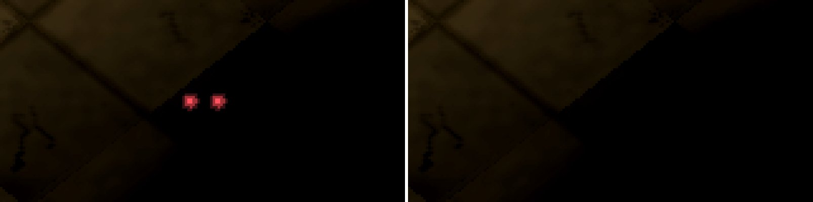

# Ce qui survit à un changement de carte ou à la fermeture d'un menu

Session cloud, branche `claude/cloud-restes`, partie d'`origin/integration-iso14` (a30a407), le 28/09/2026 de 09:18 à
~10:55 (heure de Paris). Lancée par la session coordinatrice « CLOUD ISO UNRAILED ».

## Pour Adrien, en cinq lignes

1. **Le sang d'une carte passe sur la suivante, en vraie partie.** Après un match, CHANGER DE CARTE à l'écran de fin
   puis REJOUER : les taches, les éclats de balle et les douilles du Cloître restent sur la Croisée, au même endroit —
   la gerbe de sang tombe en plein dans un bloc de mur (image `img/carte_2d_avant_apres.jpg`, à gauche).
2. En ligne, c'est pareil chez les deux joueurs (11 traces sur 11 chez l'hôte, 9 sur 9 chez l'invité).
3. **Deux yeux rouges peuvent s'allumer dans le noir pendant le match** : c'est un effet du menu (« le regard du noir »)
   qui continue de tourner en jeu ; ils apparaissent ~25 s après le dernier geste de menu, puis toutes les 25 s
   (`img/regard_scinde_avant_yeux_x5.jpg`). Un joueur peut les prendre pour l'adversaire.
4. Les deux corrections sont prêtes, chacune dans son commit, avec un test qui échoue sans elle ; **elles ne sont pas
   dans le jeu** : elles attendent ton accord. La revanche sur la même carte garde bien son sang (ta règle).
5. Le reste de l'interface ne laisse rien d'autre dans le noir pendant le match (fond des menus, particules, traînée du
   curseur : rien, mesuré à l'image torches éteintes) — une fois la torche du menu corrigée (« Disque violacé »).

## État

- [x] § 1, le sang (et les éclats, les douilles) d'une carte à l'autre : **établi, vraie partie**, en 2D, en iso et en
  ligne ; correction `dd14620` ; garde rouge avant / verte après ; images avant/après ; cueillie à blanc sur les deux bases.
- [x] § 2, le regard du noir pendant le match : **établi, vraie partie**, à l'image en écran scindé ; correction
  `baf4ca1` ; garde rouge avant / verte après ; images avant/après ; cueillie à blanc sur les deux bases.
- [x] § 2, les autres effets de menu : **écartés**, par le code et à l'image (§ 2.3).
- [x] suite complète, verte (§ 5).
- [x] vue unique (entraînement) à l'image, avant et après (§ 2.2).

### Les commits à cueillir

| commit | ce qu'il fait | fichiers |
|---|---|---|
| **`dd14620`** | les traces au sol suivent la carte (proposition) + sa garde + son inscription | `game_state.gd`, `blood_stain.gd` (commentaire), `tools/test_traces_carte.gd`, `tools/run_suites.sh` |
| **`baf4ca1`** | le regard du noir s'endort hors du menu (proposition) + sa garde + son inscription | `ui.gd`, `tools/test_regard_hors_menu.gd`, `tools/run_suites.sh` |

Tout le reste de la branche est outil, mesure, image et ce rapport. Le jeu par défaut ne change que par ces deux commits.

**Cueillette à blanc, vérifiée dans des worktrees jetables** :

| base | `dd14620` | `baf4ca1` | garde traces avant → après | garde regard avant → après |
|---|---|---|---|---|
| `origin/integration-iso14` (a30a407) | propre | propre | 3 échecs → 13/13 | 4 échecs → 11/11 |
| `origin/claude/cloud-integration-blanc` (d84c650) | propre | propre | 3 échecs → 13/13 | 4 échecs → 11/11 |
| `integration-iso14` + les quatre autres corrections du matin, dans l'ordre `b678553` (peinture), `b6f41a9` `cd5b300` (torche du menu), `dd14620`, `baf4ca1` | propre | propre | — | — |

Les inscriptions dans `tools/run_suites.sh` sont posées sur des lignes que ni « Peinture périmée » ni « Disque violacé »
ne touchent, ni adjacentes aux leurs : c'est ce qui rend les cinq cueillables ensemble sans conflit.

## 1. Le sang d'une carte à l'autre

### 1.1 Ce qui se pose et dure

Lu en entier : `blood_stain.gd`, `wall_impact.gd`, `bullet_casing.gd`, `footprint.gd`, `gadget_poudre.gd`, les poseurs de
`bullet.gd` (`_spawn_hit_effects`, `_spawn_wall_effects`) et de `player.gd` (`start_reload`), `rebuild_arena()` et
`_on_main_menu_requested()` de `game_state.gd`.

| trace | durée de vie | balayée par | passe d'une carte à l'autre ? |
|---|---|---|---|
| taches de sang (`blood_stain`, 2 par touche : flaque + gerbe) | le match, plafond 120 | le retour au menu principal seul | **oui** |
| éclats de mur (`wall_impact`) | idem, plafond | idem | **oui** — et **lus par les murs iso** (`presentation_3d._suivre_usure`) |
| douilles (`bullet_casing`, au rechargement) | idem, plafond 120 | idem | **oui** |
| copies J2 de ces trois (`blood_p2`, `wall_impact_p2`, `casing_p2`) | suivent l'original | idem | **oui** |
| copies de la peinture iso | suivent l'original (`peinture_iso._depart`) | idem | **oui**, peintes dans la nouvelle peinture |
| empreintes (`footprint`) | fondu de 2 s | elles-mêmes | non : écartée par le code (2 s < la fin de match) |
| traces de poudre (`gadget_poudre`) | fondu de 8 s | elles-mêmes | non : écartée par le code (8 s, et l'écran de fin, la galerie et le décompte en prennent plus) |
| onde de choc, relevé balistique, traces de killcam | la séquence de fin | elles-mêmes / la manche | non |

### 1.2 Reproduit par les gestes du joueur

Banc `tools/photo_restes.gd` (hérite de `photo_peinture_perimee.gd`, rien de posé à la main) : une manche en écran
scindé local lancée depuis le menu sur le Cloître, **de vrais tirs** — trois dans le mur le plus proche (éclats), un
rechargement (douille), puis sur J2 jusqu'à sa mort (le sang naît des balles ; `take_damage` n'en dépose pas) —,
l'écran de fin, CHANGER DE CARTE (la vignette de la Croisée dans la galerie), REJOUER (le bouton du cadre). À la manche 2 :
le compte des traces, la case de la nouvelle carte sous chaque original, puis J1 posé à 70 px au sud de la tache de sang,
torche braquée dessus, jeu en pause, et trois prises de l'**écran** : **A** (tel que le chemin l'a laissé), **B** (les
traces retirées à la main, le geste de la correction), **B2** (le bruit). Première image regardée à chaque séance :
aucune intro.

| | vue | traces du Cloître sous la manche 2 (originaux) | A ≠ B (> 7/255) | noirs de B allumés dans A | bruit B→B2 |
|---|---|---|---|---|---|
| AVANT | de dessus (`--2d`) | **19** : 8 sang, 5 éclats, 6 douilles (+ 19 copies J2) | 36 271 px (max 194) | **1 127** | 0 |
| AVANT | iso | **19** (+ 38 copies J2 et de peinture ; 5 impacts lus par les murs iso) | 30 925 px (max 230) | **92** | 0 |
| APRÈS (`dd14620`) | de dessus | **0** | A après = B avant : **0 pixel, au bit** | 0 | 0 |
| APRÈS | iso | **0** (0 impact lu par les murs) | A après contre B avant : 73 px ≤ 31/255 (bruit de lancement : corps, souffle) | **0** | 0 |

**Où elles tombent.** Les centres des traces (la flaque sous J2, les douilles aux pieds de J1, l'éclat au pied du mur
du Cloître) tombent sur des cases de SOL de la Croisée — les deux cartes ont leur départ au même endroit. Mais :
- **la gerbe de sang déborde dans un mur** : elle couvre le bloc en H de la Croisée, en vue de dessus comme dans la vue
  de J2 (`img/carte_2d_avant_A_B_difference.jpg`, `img/carte_2d_avant_apres.jpg`) ; en iso, elle est peinte sur le sol
  ET sur les faces des murs voisins, dans les deux moitiés (`img/carte_iso_avant_A_B_difference.jpg`,
  `img/carte_iso_avant_apres.jpg`) ;
- **les éclats de mur flottent sur du sol nu** : le mur du Cloître qu'ils marquaient n'existe plus (la tache jaune en
  haut à gauche de l'image iso avant) ;
- **elles se voient** : sous la torche, 36 000 pixels changent ; dans le noir, 1 127 pixels noirs s'allument en vue de
  dessus (la gerbe rouge sous la lueur ambiante de la vue de J2), 92 en iso.

**En ligne** (banc `tools/banc_traces_en_ligne.gd`, deux instances ENet headless, `docs/iso/cloud/restes/en_ligne.sh`) :
l'hôte abat J2 par de vrais tirs, l'écran de fin, l'hôte choisit la Croisée, REJOUER des deux côtés.

| | hôte | invité |
|---|---|---|
| AVANT, CHANGER DE CARTE | **11 traces sur 11** restent (8 sang, 3 douilles) | **9 sur 9** (6 sang, 1 éclat, 2 douilles) |
| APRÈS, CHANGER DE CARTE | 0 sur 11 | 0 sur 9 |
| APRÈS, REVANCHE (même carte) | 11 sur 11 restent | 9 sur 9 restent |

Journaux : `en_ligne_avant.txt`, `en_ligne_apres.txt`, `en_ligne_revanche_apres.txt`. Remarque : l'hôte et l'invité
n'ont pas les mêmes traces (les effets d'impact sont locaux) ; c'était déjà le cas, la correction n'y touche pas.

**Classement : arrive en vraie partie**, par tout chemin qui change de carte sans repasser par le menu principal :
écran de fin → CHANGER DE CARTE → REJOUER (local et en ligne, hôte et invité), écran de fin → retour → ENTRAÎNEMENT
(par le code : `_on_training_requested` pose l'arène standard puis `_do_start_round` → `rebuild_arena`), l'appariement
lancé de l'accueil atteint par le retour de l'écran de fin (par le code ; exige Epic). **Impossible** : l'éditeur
(« tester » change de scène, `Main` est libéré), le retour au menu principal (balayé).

### 1.3 La correction (`dd14620`)

`GameState.balayer_les_traces_si_la_carte_change(data)`, appelé en tête de `rebuild_arena()` — le seul endroit rappelé
à chaque manche qui connaît la carte posée, déjà celui où l'audio et la présentation iso suivent la carte :

- une empreinte du **contenu** de la carte (`Dictionary.hash()`), retenue à chaque reconstruction ;
- si elle change, les enfants directs de l'arène des six groupes de traces sont retirés de leur groupe, de l'arbre, et
  libérés ; les copies de la peinture iso partent avec leur original (`peinture_iso._depart`, sur `tree_exiting`), et
  l'usure des murs iso se refait d'elle-même (`_suivre_usure` voit l'empreinte des éclats changer) ;
- à carte égale — revanche, manches d'un même match —, rien ne change : **la règle d'Adrien, « rematch compris », tient.**

**Pourquoi le contenu et pas l'identifiant** : l'invité en ligne adopte la carte de l'hôte (`_adopt_host_map`) sans
qu'elle soit forcément à son catalogue ; c'est la géométrie qui décide si une trace a encore un sol sous elle. Mesuré :
la revanche en ligne garde toutes les traces chez l'invité aussi, son empreinte est stable d'une manche à l'autre.
**Pourquoi pas le groupe seul** : les copies de la peinture iso entrent aussi dans les groupes J2, mais vivent dans la
sous-vue de la peinture ; les retirer à la main doublerait le travail de `peinture_iso`. **Pourquoi pas dans chaque
trace** : trois scripts dupliqués (`wall_impact.gd` le dit : « deux occurrences ne font pas encore un motif ») ; la
règle tient en un endroit.

Coût : un `hash()` de la carte par manche (quelques kilo-octets de dictionnaire) ; rien par image. Aucun masque de
lumière, aucun shader, `Protocol.VERSION` inchangé (18) ; rien de réseau (chaque machine balaie sa propre arène).
Commentaire mis à jour : `blood_stain.gd` l. 8-15.

**La garde** `tools/test_traces_carte.gd` (headless, inscrite dans la suite) : partie locale en écran scindé, vue iso,
sur le Cloître ; traces posées par les poseurs du jeu (deux taches, un éclat, un rechargement), douille immobile ; la
revanche garde tout (traces et copies de peinture) ; la Croisée n'en garde aucune (ni copie J2, ni copie de peinture, ni
impact lu par les murs iso) ; une trace neuve s'y pose et s'y copie. **Sans la correction : 3 échecs ; avec : 13/13.**

## 2. Les effets de menu qui débordent sur le match

Fait avec la correction de la torche du menu cueillie (`b6f41a9`, `cd5b300`) dans un worktree jetable, pour ne pas
retrouver le disque violacé déjà expliqué.

### 2.1 Ce que `_set_focus` et l'interface posent, lus en entier

| effet | fichier | où il vit | en match | verdict |
|---|---|---|---|---|
| torche du curseur (M9) | `menu_torch.gd` | enfant de l'UI, `top_level` | restait peinte | déjà corrigé (« Disque violacé », `cd5b300`) |
| **regard du noir (M3)** | `menu_watcher.gd` | enfant de l'UI, `top_level`, `PROCESS_MODE_ALWAYS`, plein écran | **visible et traité** : son silence ne se rompt qu'à `_set_focus`, que le match n'appelle jamais → deux yeux après 25 s, puis toutes les 25 s | **défaut établi** (§ 2.2) |
| fond de menu, brume et bruit de l'œil (M12, M5) | `menu_backdrop.gd` | un `Node` qui ne dessine rien : il pousse des uniformes au matériau des aplats de fond du menu et de la pause | ces aplats sont cachés avec leurs panneaux ; seul `_process` (la parallaxe) peut tourner, et il s'arrête à sa cible | écarté : rien ne dessine hors d'un panneau ouvert ; 0 pixel à l'image |
| rémanence du curseur (M2) | `menu_after_image.gd` | UI, `top_level` | fantômes de 0,35 s, puis `set_process(false)` et plus rien à dessiner | écarté (dure moins que le décompte) ; 0 fantôme au début de manche |
| traçante du départ (M8) | `menu_tracer.gd` | UI, `top_level` | un vol de 0,20 s au clic qui lance | écarté (idem) ; `_t = -1` au début de manche |
| passant derrière la vitre (M4) | `menu_passerby.gd` | enfant du panneau de fin | caché avec lui | écarté |
| particules d'ambiance | `menu_particles_ambiance.gd` | dans le hub (et l'intro) | cachées avec le hub (`hub visible false` au début de manche) | écarté ; 0 pixel à l'image |
| halo du hub (`hub.set_torch_position_global`) | `menu_hub.gd` | dans le hub | caché avec lui | écarté |

### 2.2 Le regard du noir, à l'image

Banc `tools/photo_regard.gd` : une manche lancée depuis le menu comme un joueur (écran 1v1 local puis JOUER), torches
éteintes, personne ne bouge ; prises de l'**écran** en paires — interface visible / calque `Main/UI` caché ; un pixel
noir sans l'interface et allumé avec est une « fuite » ; puis la **descente** : chaque enfant de l'UI caché seul, pour
dire lequel éteint les pixels de fuite. Le regard vit en `PROCESS_MODE_ALWAYS` : il est figé le temps d'une paire
(la pause du jeu ne l'arrêterait pas).

| | instant | fuite totale | ce qui l'éteint (descente) |
|---|---|---|---|
| AVANT (torche corrigée, regard non) | 8 s | 149 255 px | le HUD (`MarginContainer`, 147 247 px : cadres des joueurs et chronomètre) ; `Panel` (1 856 px : le séparateur vertical de l'écran scindé, colonnes 957 et 962) |
| AVANT | **22,6 s : le regard est venu** | **149 333 px** | les mêmes + **`RegardDuNoir` : 78 px** — deux yeux rouges, (59, 17, 20) en moyenne, **137/255 au plus**, en (172, 462) et (183, 462), dans le noir de la moitié de J1 |
| APRÈS (`baf4ca1`) | 8 s | 149 255 px | le HUD et le séparateur, seuls |
| APRÈS | 40 s : **le regard n'est jamais venu** | 149 255 px | le HUD et le séparateur, seuls |



*×5, éclaircie ×2 : à gauche, les deux yeux dans le noir en match (avant) ; à droite, le même endroit après la
correction. Dans la vignette, 4 883 pixels allumés avant contre 4 805 après : les 78 des yeux.*

- **Pourquoi 22,6 s et pas 25** : le regard compte depuis le dernier geste de MENU (ici la graine de focus de l'écran
  1v1), pas depuis le début de la manche. Au début de la manche, il avait déjà 3,5 s de silence (journal `EFFETS`).
- **Où** : dans les marges de l'ÉCRAN (12 % de la largeur à gauche ou à droite, de 25 à 85 % de la hauteur), tirées au
  sort ; en écran scindé, donc toujours chez un seul des deux joueurs, et jamais au même endroit. **Équité** : un effet
  tiré au sort chez un seul joueur, rouge — la couleur de J2 —, en forme d'yeux, dans le noir du duel.
- **En vue unique** (entraînement lancé de l'accueil, `--mode=unique`) : même défaut à l'image. Le regard vient à
  **25,6 s** de jeu, **82 pixels** allumés dans le noir (moyenne (62, 18, 21), 137/255 au plus) en (86, 607) et
  (97, 607) ; le reste de la fuite (108 144 px) est le HUD seul (`img/regard_unique_avant_yeux_x5.jpg`). En ligne, la
  vue unique est la même (par le code ; pas d'image à deux fenêtres). **Après la correction** : regard jamais venu en
  40 s de jeu, fuite 108 144 px à 8 s comme à 40 s, le HUD seul (`img/regard_unique_avant_apres_x5.jpg`).

**Classement : arrive en vraie partie**, dans tout match de plus de ~25 s, par défaut (`regard_du_noir` vaut 1,0 tant
que le joueur ne l'a pas baissé dans les réglages de la vitrine) ; en ligne comme en local ; la pause (un menu) le
réveille légitimement.

### 2.3 La correction (`baf4ca1`)

`ui._endormir_le_regard_hors_menu()`, appelé dans `ui._process` juste après `_update_focus_rings()` : hors menu (le même
critère « menu ouvert » que `_update_focus_rings` — panneau de fin, pause, dialogue —, recopié pour ne pas toucher à
ses lignes, que modifie aussi la correction de la torche), le regard s'endort : `set_process(false)` et `reveiller()`,
qui efface des yeux déjà ouverts (avec redessin) et remet le compte à zéro. Menu rouvert, il se réveille. Ne bascule
qu'au changement : **aucun appel au regard par image en match**, zéro coût (la règle de la vitrine). Aucune constante ni
comportement du regard au menu ne change.

**Pourquoi pas dans `_update_focus_rings`**, à côté de l'extinction de la torche : c'est là que `cd5b300` écrit ; deux
corrections dans le même bloc ne se cueilleraient plus séparément. **Pourquoi pas cacher le nœud** : son `_draw` est à
la demande, un nœud caché garde son dernier dessin en mémoire et le compte `_repos` continuerait ailleurs ; endormir
le traitement ET effacer est la seule forme qui ne laisse ni dessin ni horloge.

**La garde** `tools/test_regard_hors_menu.gd` (headless, UI seule, le harnais de `test_torche_hors_menu.gd`) : le temps
est simulé en appelant `_process(1.0)` du regard **seulement quand le moteur le traiterait** (`is_processing()`) ; menu
ouvert, les yeux viennent après 25 s ; menu fermé comme au lancement d'une manche, les yeux ouverts s'effacent, une
minute de match n'en rallume aucun, plus aucun redessin ; menu rouvert, il recompte de zéro. **Sans la correction :
4 échecs ; avec : 11/11.**

## 3. Pistes écartées, en une ligne

- **Empreintes et traces de poudre** d'une carte à l'autre : fondu de 2 s et 8 s, plus court que l'écran de fin et le
  décompte réunis (par le code).
- **Fond de menu** (`menu_backdrop`) en match : ne dessine rien lui-même, ses aplats sont cachés avec leurs panneaux ;
  0 pixel de fuite attribué hors HUD, avant comme après.
- **Rémanence, traçante, passant, particules, halo du hub** : cachés avec le menu ou éteints en moins d'une demi-seconde ;
  0 pixel de fuite hors HUD à 8 s et à 40 s de jeu.
- **Le HUD et le séparateur** allument le noir sous eux (149 255 px) : c'est l'interface voulue, pas un débordement ;
  même compte avant et après, et à 8 s comme à 40 s.

## 4. Défauts hors de ma tâche — signalés, pas corrigés

1. **Les traces de l'hôte et de l'invité diffèrent** en ligne (11 contre 9 au même match, `en_ligne_avant.txt`) : chaque
   machine pose les siennes à ses propres impacts. Cosmétique et local, mais une tache peut n'exister que chez l'un des
   deux. Non cherché plus loin.
2. `ERROR: Condition "!is_inside_tree()" is true. Returning: Ref<World2D>()` (`get_world_2d`, depuis
   `audio_manager.gd:2395 diagnostic_ecoute` ← `rendre_oreille`) à la sortie de chaque séance et de la garde des
   traces : déjà signalé par « Peinture périmée » § 5.4, avant comme après ; non compté par `run_suites.sh`.
3. Un banc qui retire des traces **jeu en pause** doit redemander le rendu de la peinture iso (`peinture_iso` ne se
   refait qu'à son `_process`) : sans quoi les murs divisent la lumière neuve par l'ancienne peinture et virent au vert
   (vu à ma première séance, corrigé dans le banc). Le jeu, lui, n'est jamais en pause à ce moment.

## 5. Suite complète

`GODOT=/usr/local/bin/godot ./tools/run_suites.sh` sur la branche, les deux corrections comprises (le code du jeu et des
outils n'a plus changé ensuite, seulement la documentation et les images) : **« tout passe, sans erreur de script
(710 s) », EXIT 0** — `test_traces_carte` et `test_regard_hors_menu` compris.

## 6. Pièges à reporter dans la feuille de route

- **« Seul le retour au menu principal balaie les traces » n'est plus une garantie depuis que l'écran de fin permet de
  changer de carte** (ISO11 L4). Une trace posée en coordonnées de monde n'a de sens que sur la carte qui l'a reçue :
  ce qui dure « le match » doit durer « la carte ».
- **Un effet de menu en `PROCESS_MODE_ALWAYS` qui vit au niveau des curseurs est aussi un effet de match** : l'UI reste
  visible en jeu (le HUD). Tout effet de vitrine doit dire lui-même quand il s'arrête, ou être endormi hors menu ; « le
  match n'appelle pas `_set_focus` » est la raison exacte pour laquelle rien ne l'arrêtait.
- **Chercher un débordement d'interface : paire écran avec / sans le calque d'UI, puis descente enfant par enfant.**
  Les prises « vue » cachent l'interface (piège 2 de « Disque violacé ») ; le HUD fait 149 255 px de « fuite » légitime
  dans ce cadre, donc on compte ce que chaque enfant éteint, pas la fuite totale.
- **En ligne, un banc qui téléporte la cible à chaque image ne la touche jamais** : la compensation de latence de l'hôte
  juge la balle contre l'historique (RTT/2 + 100 ms). La tenir immobile une seconde avant de tirer.
- **Sans souris, J1 de l'hôte vise où dit son fournisseur d'entrées, pas où dit sa rotation** : un banc qui veut tirer
  pose une marionnette de visée (`_set_player_input_provider`).

## 7. Pour tout refaire

```bash
git fetch origin claude/cloud-restes && git checkout claude/cloud-restes
godot --headless --path . --import                     # la première fois
pip install numpy pillow scipy
export XDG_DATA_HOME=$PWD/.xdg ; U="$XDG_DATA_HOME/godot/app_userdata/Candela 2D"
# Les gardes, puis la suite complète :
godot --headless --path . --script res://tools/test_traces_carte.gd
godot --headless --path . --script res://tools/test_regard_hors_menu.gd
GODOT=/usr/local/bin/godot ./tools/run_suites.sh
# AVANT : les mêmes commandes dans un worktree sans la correction (git worktree add /tmp/avant dd14620^ pour les
# traces ; baf4ca1^ plus `git cherry-pick b6f41a9 cd5b300` pour le regard, torche du menu corrigée).
# § 1, les traces à l'image (sous Xvfb, ~5 min en 2D, ~10 min en iso sous llvmpipe) :
xvfb-run -a -s "-screen 0 1920x1080x24" godot --fixed-fps 60 --path . res://tools/photo_restes.tscn \
  -- --no-eos --led-murs-fige --chemin=carte --2d --sortie=user://restes/carte_2d        # sans --2d : l'iso
python3 docs/iso/cloud/restes/mesurer.py traces "$U/restes/carte_2d" carte_2d
#    --chemin=revanche (même carte) et --chemin=entrainement existent aussi.
# § 1, en ligne (deux instances ENet headless, ~3 min ; REVANCHE=1 pour la revanche) :
GODOT=/usr/local/bin/godot ./docs/iso/cloud/restes/en_ligne.sh
# § 2, le regard à l'image (--mode=unique pour l'entraînement ; ~10 min) :
xvfb-run -a -s "-screen 0 1920x1080x24" godot --fixed-fps 60 --path . res://tools/photo_regard.tscn \
  -- --no-eos --led-murs-fige --mode=scinde --sortie=user://regard/scinde
python3 docs/iso/cloud/restes/mesurer.py regard "$U/regard/scinde" regard_scinde
```

Sur le Mac : les mêmes commandes sans `xvfb-run …`, avec `godot` = `/Applications/Godot.app/Contents/MacOS/Godot`, la
fenêtre au premier plan. Pour voir les yeux en vrai : lancer « 1v1 écrans scindés », ne plus toucher au menu, torches
éteintes, attendre 25 s dans une zone noire et regarder les marges gauche et droite de l'écran.

## 8. Ce que je n'ai PAS pu prouver

- **La cadence** : aucun chiffre d'images par seconde ici. Les deux corrections n'ajoutent rien par image (un `hash()`
  par manche ; une bascule du regard au changement de menu seulement) ; à mesurer au Mac si on le juge utile.
- **Le chemin ENTRAÎNEMENT et l'appariement** pour les traces : établis par le code (même `rebuild_arena`), pas
  photographiés ; l'appariement exige Epic.
- **Une trace dont le centre tombe dans un mur** de la nouvelle carte : dans mes séances, les deux cartes partagent leur
  zone de départ, les centres tombent sur du sol ; c'est la gerbe qui déborde dans le mur. Un combat ailleurs sur la
  carte le produirait ; non mis en scène.
- **La revanche à l'image** : prouvée par la garde et en ligne (comptes), pas photographiée.
- **Le regard en ligne** : par le code seulement (pas d'image à deux fenêtres).
- **L'éblouissement et les corps** : le cloud ne les juge pas (rendu llvmpipe) ; hors sujet ici.
