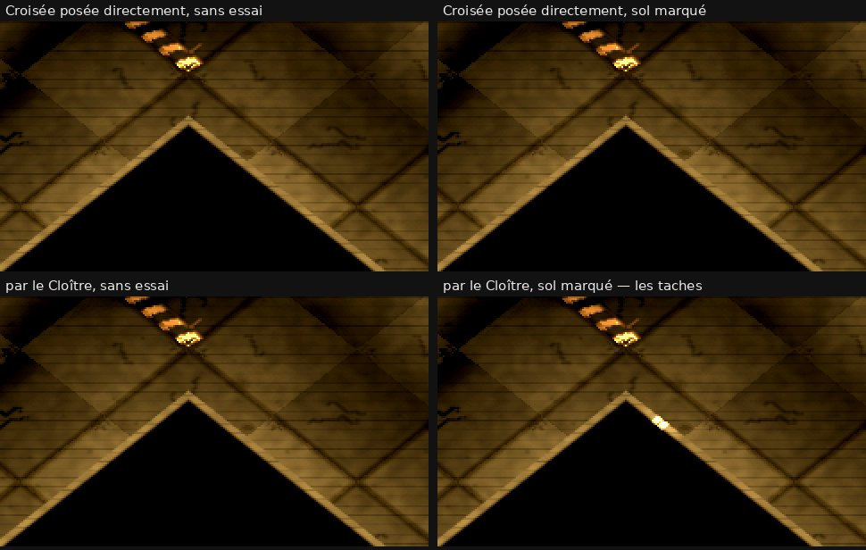

# Le sol marqué, deuxième passage — les points allumés dans le noir

Session cloud, branche `claude/cloud-sol-marque-2`, partie d'`origin/claude/cloud-sol-marque` (9e398d5), le 28/09/2026.
Lancée par la session coordinatrice « CLOUD ISO UNRAILED ».

## Plan (écrit à 07:25, avant tout code)

1. **Reproduire** le défaut de l'évaluation 11 (`docs/iso/cloud/ecart-11/RAPPORT.md` § 4 : torches éteintes, Croisée,
   taches jaunes de 2 à 5 px sur le liseré du sommet d'un mur haut, avec `--sol-marque-essai` seul en cause).
2. **La cause, par une prise dédiée, écrite AVANT la correction** : quelle marque, à quelle distance de l'arête, quelle
   peinture au point où le liseré lit la lumière (`mur_iso.gdshader`, `lire_lumiere_moyenne(… d_bord + pied …)`,
   `pied = 8` posé par `presentation_3d.gd`, quatre lectures à ±0,625 et ±1,875 px le long de l'arête).
   Premier constat, lu dans le code : la garde de l'essai tient les marques à **12 px** des cases de mur, et le liseré lit
   à **8 px** de l'arête, dans une peinture à 1 texel par pixel de monde, filtrée linéairement. Sur le papier, 4 px de
   marge : il faut donc trouver ce que le papier ne voit pas (une emprise plus large que promise, une arête qui n'est pas
   celle d'une case de mur, un autre calque de peinture).
3. **Corriger dans l'essai seulement** (tenir les marques loin des points de lecture, filtrage compté), avec une garde
   headless sur les six cartes. Le shader des murs n'est pas touché : si la division par la peinture est la vraie cause,
   c'est écrit ici pour Gadgets.
4. **Les pochoirs** (`--pochoirs-essai`) : même calcul, même prise ; signalés s'ils peuvent faire la même tache.
5. **La preuve** : six cartes, 45° B, vue unique et écran scindé, torches éteintes, prises A/B/A' ; torches allumées,
   rien de plus clair que la surface qui porte ; drapeau éteint, rien ne change au bit ; suite complète verte.

## 1. La cause (établie à 08:50, AVANT toute correction)

**Ce ne sont pas les marques de la Croisée. Ce sont celles du Cloître** : quand la carte change pendant que la vue iso est
allumée, les murs de la nouvelle carte continuent de diviser leur lumière par la PEINTURE DE L'ANCIENNE (`peinture_iso.gd`).
Le banc de l'évaluation 11 (`tools/photo_ecart.gd`, scènes `croisee` et `bunker`) passe du Cloître à la Croisée dans la même
partie, vue allumée ; les marques du Cloître tombent sous des points où les murs de la Croisée lisent la lumière.

### Le mécanisme, dans le code

- `presentation_3d.gd:493` : quand `rebuild_arena()` rappelle le crochet pendant que la vue tient (`_reconstruire`), la
  présentation refait **les murs** (`_construire_les_murs`) — et rien d'autre. La peinture n'est refaite que par
  `_allumer` (`presentation_3d.gd:606`, `_poser_peinture`), c'est-à-dire quand la vue s'allume.
- La peinture (`peinture_iso.gd`) est faite de **copies** des calques de l'arène (`CustomFloor_P1`, `ArenaDecor_P1`,
  `MurEncre_P1`), enfants de la sous-vue. `rebuild_arena` libère les originaux ; les copies restent, avec l'ancienne
  texture cuite du décor (`_decor_source` n'est plus valide, `_process` ne la remplace plus). Le cadre reste aussi celui de
  l'ancienne carte.
- `mur_iso.gdshader`, `lire_lumiere` : `l × réf ÷ max(peinture, plancher)`. Sous la lumière des LED (réelle), une
  peinture étrangère plus sombre que le sol — une marque, une encre de mur, un mur — gonfle la lecture jusqu'à ×3,3
  (réf 0,163 ÷ plancher 0,05).

### La preuve, par une prise dédiée (`tools/photo_sol_marque_noir.gd`)

Croisée, torches éteintes, J1 et J2 à la place de l'évaluation 11, LED figées, les neuf drapeaux d'hier ; chaque prise est
triple au même instant, jeu en pause (A marques, B marques retirées et décor recuit, A' remises). Pixels de l'évaluation 11 :
(1041, 305) et (1046, 309).

| lancement | peinture lue par les murs | A | B | A' |
|---|---|---|---|---|
| Croisée posée directement, sol marqué | 1050 × 1050 (la sienne) | (4, 0, 0) | (4, 0, 0) | (4, 0, 0) |
| **par le Cloître**, sol marqué (`--par=map_001_le_cloitre`) | **1120 × 1120 (celle du Cloître)** | **(49, 36, 14)** | **(49, 36, 14)** | **(49, 36, 14)** |
| par le Cloître, sans essai (`--temoin`) | 1120 × 1120 (celle du Cloître) | (4, 0, 0) | (4, 0, 0) | (4, 0, 0) |

- Posée directement, la Croisée n'a pas les taches, marques ou pas : **0 pixel noir allumé par l'essai** (A contre B).
- Passée par le Cloître, les taches sont là **aussi en B**, marques de la Croisée retirées : ce ne sont pas elles.
- Elles disparaissent du témoin sans essai passé par le Cloître : elles viennent des marques **du Cloître**, dans la
  peinture restée branchée (la ligne `PEINTURE` du journal donne la taille que le matériau des murs lit : 1120, pour une
  carte de 980 + 70).
- Reproduit aussi sur le code même de l'évaluation 11 (worktree de `origin/claude/cloud-ecart-11`, 2a2c099) : sa commande
  donne (49, 36, 14) avec le drapeau et (4, 0, 0) sans ; ma prise triple, Croisée posée directement, n'en montre aucune.

**Le calcul le confirme** (`lecture.py` : les quatre lectures bilinéaires de chaque arête exposée de mur haut, divisées puis
moyennées, comme le shader). Avec les murs de la Croisée et la peinture cuite du Cloître, six arêtes lisent autrement ; celle
de la case (7, 7), face nord, lecture en (258,75 ; 233) — le sommet photographié — gagne **×1,73** (peinture 0,163 → 0,054) ;
la pire, case (25, 4), ×2,27. Au Bunker, par le Cloître, sept arêtes, ×1,66 au pire : les taches « sous le bruit » de
l'évaluation 11. **Avec la peinture de leur propre carte, 0 arête sur les six cartes** (sol marqué comme pochoirs), dans la
texture cuite comme dans la peinture vidée en jeu : les marques les plus proches d'une case non-sol en sont à **13,5 px**
(centre du texel), les lectures à 12 px, le filtre bilinéaire n'atteint qu'1 px au-delà.

### Deux erreurs de lecture qu'il faut corriger ailleurs

- **`pied` vaut 12 px en jeu, pas 8.** `mur_iso.gdshader` le déclare à 8 et `presentation_3d.gd:1698` pose 8
  (`PIED_PX`), mais `IsoMateriaux.accorder_mur`, appelé juste après (l. 1700), repose `PIED_FACE_PX` = 12. L'évaluation 11
  a lu le 8 du shader. Le sol marqué ne tenait donc que par une marge d'un demi-pixel (13,5 − 12 − 1), et parce que les
  emprises promises à la garde sont plus larges que le dessin.
- **Ce n'est pas le sol marqué qui enfreint la règle des pochoirs, c'est la peinture périmée**, et elle l'enfreint AUSSI
  sans aucun essai : témoin sans essai posé directement → même témoin passé par le Cloître, **822 pixels noirs s'allument**
  (521 au-dessus de 30/255, 55 au-dessus de 100, jusqu'à 255) : des pans entiers de faces de la Croisée lisent les murs et
  l'encre du Cloître (`img/cause_direct_temoin.jpg` contre `img/cause_par_cloitre_temoin.jpg`, éclaircies ×4).

### Ce que cela change pour la tâche

- **Il n'y a rien à corriger dans le sol marqué pour ce défaut.** La correction qui supprime les taches est dans
  `presentation_3d.gd` (refaire la peinture quand la carte change, vue allumée) : c'est le jeu par défaut, hors de ma tâche —
  **signalé, pas corrigé** (§ 5).
- **Les mesures de l'évaluation 11 sur la Croisée et le Bunker sont faites sur la peinture du Cloître** (duel comme noir) :
  à refaire, carte posée directement, ou après la correction.
- Dans l'essai, je rends la marge explicite au lieu de la laisser au hasard (§ 2).

## État

- [x] reproduction (sur cette branche et sur celle de l'évaluation 11)
- [x] cause établie
- [ ] correction et garde
- [ ] pochoirs
- [ ] preuves six cartes
- [ ] suite complète
